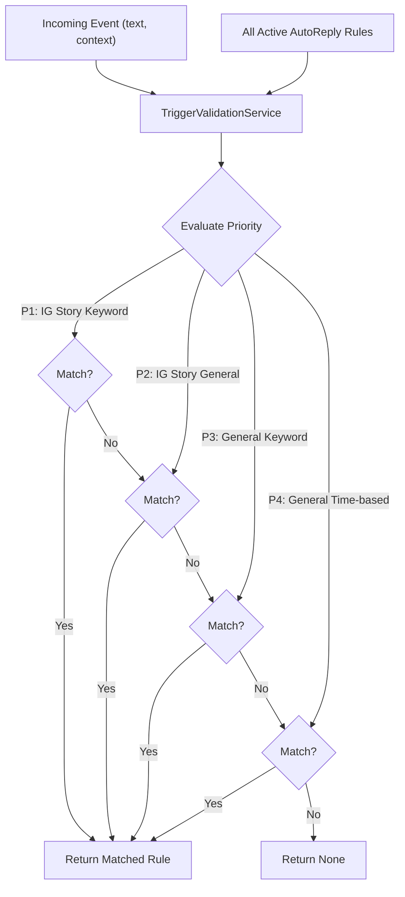

# Auto-Reply Unified Architecture (2024-07-25)

> **⚠️ IN DEVELOPMENT**  
> This document describes the new **unified multi-channel architecture** for the Auto-Reply feature, supporting LINE, Facebook Messenger, and Instagram. The legacy LINE-only system is now in maintenance mode.

## 1. Architecture Overview
This new architecture unifies auto-reply logic across multiple platforms. It introduces a new 4-tier priority system and dedicated models for handling platform-specific contexts, such as Instagram Story replies.

- **Key Differences from Legacy:**
  - **Multi-Channel:** Natively supports LINE, FB Messenger, and IG DMs.
  - **Unified Priority:** A single, 4-tier priority system applies to all rules.
  - **Context-Aware Triggers:** Supports triggers based on specific contexts, like IG Story replies.
  - **Domain-Driven Design:** Follows a clean architecture with distinct domain, service, and event models.

## 2. Major Workflows
The trigger evaluation flow is centralized in the `TriggerValidationService`.

1.  **Event Reception:** An `IncomingEvent` is created, containing message content and optional context (e.g., `ig_story`).
2.  **Rule Fetching:** All active `AutoReply` rules are fetched.
3.  **Validation:** The `TriggerValidationService.find_best_trigger` method is called.
4.  **Priority Evaluation:** The service evaluates rules based on the 4-tier priority system and returns the highest-priority match.



## 3. Terminology Mapping
This section maps the legacy `WebhookTriggerSetting` model to the new `AutoReply` domain model to clarify the transition.

| New `AutoReply` Field         | Legacy `WebhookTriggerSetting` Field | Notes                                                                                             |
| ----------------------------- | ------------------------------------ | ------------------------------------------------------------------------------------------------- |
| `id`                          | `id`                                 | Unique identifier for the rule.                                                                   |
| `name`                        | `name`                               | User-defined name for the rule.                                                                   |
| `status`                      | `enable`, `archived`                 | A new enum `AutoReplyStatus` combines the legacy boolean fields into a single state.              |
| `event_type`                  | `event_type`                         | The core trigger type. New types like `IG_STORY_KEYWORD` have been added for the unified system.    |
| `keywords`                    | `trigger_code`                       | Replaces the single string `trigger_code` with a flexible list of keywords.                       |
| `ig_story_ids`                | (N/A)                                | New field to support Instagram Story-specific triggers.                                           |
| `trigger_schedule_type`       | `trigger_schedule_type`              | Defines the schedule type (e.g., `DAILY`, `MONTHLY`).                                             |
| `trigger_schedule_settings`   | `trigger_schedule_settings`          | The JSON configuration for the schedule.                                                          |
| `(not implemented)`           | `no_disturb_interval`                | This legacy field has not yet been implemented in the new service logic.                          |
| `(not implemented)`           | `extra`                              | The generic JSON `extra` field is not part of the new typed domain model.                         |

## 4. Domain Models & API Contracts

### `AutoReplyEventType` (Enum)
- `IG_STORY_KEYWORD`: [P1] For keyword replies to a specific IG Story.
- `IG_STORY_GENERAL`: [P2] For general replies to a specific IG Story.
- `KEYWORD`: [P3] For general keyword replies on any channel.
- `TIME`: [P4] For general time-based replies on any channel.
- `FOLLOW`, `BEACON`, `POSTBACK`, `DEFAULT`: Legacy or other event types.

### `AutoReply` Model
```python
class AutoReply(BaseModel):
    id: int
    organization_id: int
    name: str
    status: AutoReplyStatus
    event_type: AutoReplyEventType
    priority: int
    keywords: list[str] | None = None
    ig_story_ids: list[str] | None = None
    trigger_schedule_type: WebhookTriggerScheduleType | None = None
    trigger_schedule_settings: WebhookTriggerScheduleSettings | None = None
    created_at: datetime
    updated_at: datetime
```

### `IncomingEvent` Model
```python
class IncomingEvent(BaseModel):
    text: str | None = None
    context: EventContext | None = None

class EventContext(BaseModel):
    ig_story: IGStoryContext | None = None

class IGStoryContext(BaseModel):
    id: str
```

## 5. Service Layer Architecture
- **`TriggerValidationService`**:
  - **Responsibility**: Implements the core 4-tier priority trigger logic.
  - **Method**: `find_best_trigger(event, rules, now)`
  - **File**: `python_src/internal/domain/auto_reply/service.py`

## 6. Migration & Compatibility
The new `AutoReply` model and `TriggerValidationService` are designed for the unified multi-channel architecture. However, to ensure backward compatibility and a phased migration, certain legacy concepts are still handled:

- **Legacy Event Types**: The `AutoReplyEventType` enum retains values like `FOLLOW` and `BEACON`. While the new `TriggerValidationService` does not implement logic for these, they are preserved in the model to allow a single, unified data structure for both legacy and new rules during the transition period.
- **Data Structure**: The `AutoReply` model is the definitive structure for all new development. Legacy `WebhookTriggerSetting` instances will be mapped or migrated to this new format.
- **Phased Rollout**: The new validation service currently focuses on `MESSAGE`-based events for LINE, FB, and IG. Legacy handlers may still process other event types until they are fully migrated into the new architecture.

## 7. Cross-Platform Integration
- **IG Story Handling**: The `IncomingEvent`'s `context.ig_story.id` field is used to match against `AutoReply.ig_story_ids`.
- **Keyword Normalization**: Logic in `_is_keyword_matched` handles case-insensitivity and trimming for all platforms.

## 8. Testing Strategy
Unit tests for the `TriggerValidationService` are implemented in `python_src/tests/domain/auto_reply/test_service.py`. The tests cover all scenarios defined in the PRD, including:
- Correct trigger for IG Story Keyword.
- Correct trigger for IG Story General.
- Correct priority between IG Story rules and General rules.
- Comprehensive testing of the full 4-tier priority system.

## 9. Development Guidelines
- All new auto-reply logic should be added to the `TriggerValidationService`.
- New trigger types or contexts should be reflected in the domain models (`auto_reply.py`, `events.py`).
- Always add corresponding unit tests for any new logic. 