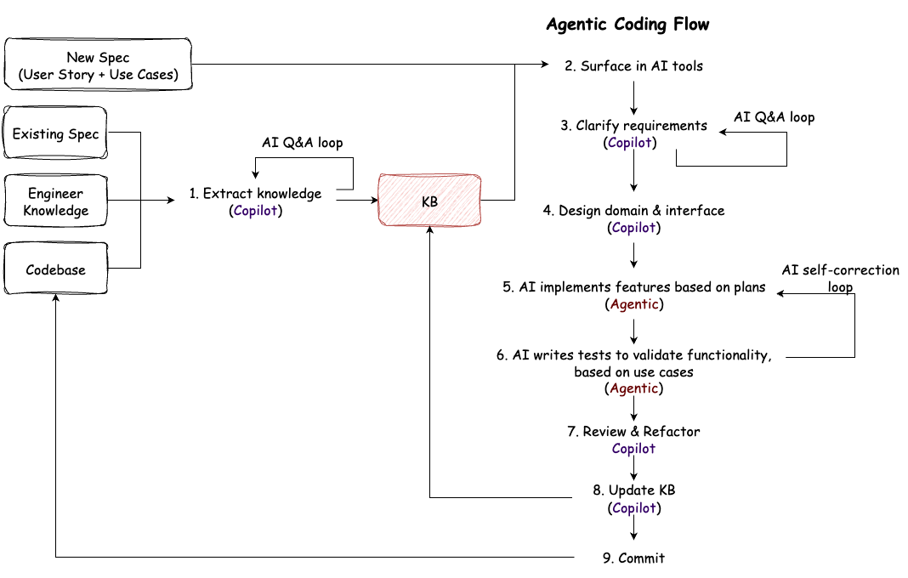

# ai-coding-workshop-250712

This workshop shows how AI agentic coding practices can improve product development speed and quality at Crescendo Lab (CL).

Using a real product feature as a case study, we reduced development time from **410 hours** to **245 hours** while improving test coverage—**1.6x faster delivery**.

By the end of this workshop, participants will have a better understanding of:
- **Context-Driven Development** - Provide comprehensive context (PRD, KB, domain models) to AI for **better code generation**
- **Design-First Approach** - Plan interfaces and tasks **before implementation**
- **Knowledge Base Management** - Extract and maintain domain expertise for **better AI context**

## 🚀 Quick Start

**Requirements:** AI coding assistant (Cursor, Claude, etc.) + basic programming experience

**How to Use This README:**
- **[AI Coding Principles](#ai-coding-principles-at-cl)** - Learn the 3 C's framework and AI workflow (read this first!)
- **[Workshop Outline](#workshop-outline)** - See all 4 tutorials with time estimates
  - **Learning Path:** Tutorial 1 (90min) → Tutorial 2 (40min) → Tutorial 3 (40min) → Tutorial 4 (20min)
  - **Stuck?** Check FAQ sections in tutorials. Confusion is normal and part of the learning!
- **[Case Study](#case-study---omnichannel-auto-reply)** - Understand what you're building (don't worry if it's complex!)
- **[Codebase Outline](#codebase-outline)** - Find working directories and reference materials
- **[Workshop Setup](#workshop-setup)** - Detailed environment setup if `make init` fails

## AI Coding Principles at CL

At Crescendo Lab, we follow the **3 C's** of AI coding:

- **Context**: Provide **comprehensive background** (PRD, KB, design docs) before coding 
- **Control**: **Humans drive decisions**, AI executes
- **Critique**: Always **validate and verify** outputs. No vibe coding.

### AI Agentic Coding Workflow



<details>
<summary><strong>Details</strong></summary>

**Inputs**
- **New Spec** (User Story + Use Cases) - Requirements for new features
- **Existing Spec** - Current system documentation and requirements
- **Engineer Knowledge** - Domain expertise and tribal knowledge
- **Codebase** - Current implementation and architecture

**Roles**
- **Copilot**: Human-guided AI assistance for planning, clarification, and review
- **Agentic**: Autonomous AI execution for implementation and testing

**Steps**
1. **Extract knowledge** (Copilot) → **KB** ← AI Q&A loop (*1)
   - Convert engineer knowledge and existing code into structured knowledge base
2. **Surface in AI tools** (VSCode, Cursor, Windsurf, etc.)
   - Make knowledge available to AI coding assistants through context
3. **Clarify requirements** (Copilot) ← AI Q&A loop (*1)
   - AI asks clarifying questions to ensure complete understanding
4. **Design domain & interface** (Copilot)
   - Human-driven architectural decisions and API design
5. **AI implements features based on plans** (Agentic) ← AI self-correction loop (*2)
   - Autonomous implementation with error correction
6. **AI writes tests to validate functionality, based on use cases** (Agentic) ← AI self-correction loop (*2)
   - Comprehensive test coverage derived from the requirements
7. **Review & Refactor** (Copilot)
8. **Update KB** (Copilot)
   - Capture new learnings and patterns for future development
9. **Commit**

**Key Feedback Loops**
- (*1): **AI Q&A loop**: Iterative clarification and knowledge extraction
- (*2): **AI self-correction loop**: Automatic refinement during implementation and testing

</details>

## Workshop Outline

This workshop guides participants through **step-by-step agentic coding practice** using the [Omnichannel Auto-Reply](#case-study---omnichannel-auto-reply) case study across the following sections:

| Section | Topic                  | Description                                                                 | Estimated Time | Tutorial |
|---------|------------------------|-----------------------------------------------------------------------------|----------------|----------|
| 1       | Rewrite Brownfield     | Build Omnichannel Auto-Reply trigger logic with agentic coding              | 1h 20m         | [link](./tutorials/1_rewrite_brownfield.md) |
| 2       | Extend Functions       | Extend Omnichannel Auto-Reply to support IG story-specific                  | 40m            | [link](./tutorials/2_extend_function.md) |
| 3       | KB Extraction          | Extract knowledge from codebase and tribal knowledge for critical features  | 40m            | [link](./tutorials/3_kb_extraction.md) |
| 4       | Sharpen your prompts   | Patterns for effective agent instructions                                   | 20m            | [link1](./tutorials/4_chat_conclusion.md), [link2](./tutorials/5_personal_rules.md) |

---

# Case Study - Omnichannel Auto-Reply

## Background

**Auto-Reply** is a **critical product feature** at CL that helps our customers **automatically respond** to their end users' messages using pre-defined keywords and time schedules via their [LINE official account](https://www.linebiz.com/jp-en/) (LINE OA).

Currently, CL is planning to extend Auto-Reply to **Facebook Messenger and Instagram accounts**, based on the existing LINE version, called **Omnichannel Auto-Reply**.

The key differences between the new and existing Auto-Reply:

| Feature                      | Legacy System                                 | Omnichannel System                                         |
|------------------------------|-----------------------------------------------|------------------------------------------------------------|
| Platform Support             | LINE only                                     | **LINE, Facebook Messenger, Instagram DMs**                    |
| Architecture                 | Single-channel, direct access                 | **Multi-channel with parent-child model**                      |
| Data Model                   | WebhookTriggerSetting → WebhookTriggerMessage | **AutoReply → AutoReplyChannelSetting → AutoReplyMessage**     |
| Keyword Triggers             | ✅ MESSAGE                                    | ✅ MESSAGE                                                 |
| Keyword Match                | Case-sensitive exact match                    | **Case-insensitive + trim spaces exact match**                 |
| Multiple Keywords per Rule   | ❌ One trigger_code per WebhookTriggerSetting | ✅ **Multiple keywords per AutoReply rule**                    |
| General Time-based Triggers  | ✅ Schedule type priority                     | ✅ Schedule type priority                                  |
| Cross-Platform Rules         | ❌ LINE only                                  | ✅ **One rule → multiple channels**                            |
| IG Story Integration         | ❌ Not supported                              | ✅ **4-level priority system with story-specific triggers**    |
| Conflict Resolution          | First match wins, manual admin avoidance      | ✅ **Automatic constraint validation**                         |
| Cross-Channel Reporting      | ❌ LINE only                                  | ✅ **Channel-specific breakdowns**                             |
| Rule Management              | Per-bot configuration                         | ✅ **Hierarchical parent-child model**                         |
| Backward Compatibility       | N/A                                           | ✅ **Full LINE compatibility maintained**                      |

### Product Briefing

**Videos**

Omnichannel Auto-Reply (Keyword + General):

https://github.com/user-attachments/assets/f1a52e80-2664-4694-b675-4534b5f1f4bc

Omnichannel Auto-Reply (IG Story-Specific):

https://github.com/user-attachments/assets/7d6c07c0-cb5f-4645-b150-e2b25925c858

**Help Center Documentation**

- Auto-Reply Introduction: [CH](https://crescendolab.zendesk.com/hc/zh-tw/articles/48047855114137-%E5%8A%9F%E8%83%BD%E8%AA%AA%E6%98%8E-Omnichannel-%E8%87%AA%E5%8B%95%E5%9B%9E%E6%87%89-%E5%90%AB-FB-IG-LINE), EN
- Auto-Reply Tutorials: [CH](https://crescendolab.zendesk.com/hc/zh-tw/articles/48502467789209-%E8%A8%AD%E5%AE%9A%E6%95%99%E5%AD%B8-Omnichannel-%E8%87%AA%E5%8B%95%E5%9B%9E%E6%87%89), [EN](https://crescendolab.zendesk.com/hc/en-us/articles/39949866982425-Tutorials-NEW-Auto-reply)


### PRD, KB, and Domain Knowledge 

PRDs
- [Keyword + General](./spec/prd-part1.md)
- [IG story-specific](./spec/prd-part2.md)

KB & Domain models
- [KB](./legacy/kb/auto_reply.md)
- Domain models
    - [go](./go_src/internal/domain/)
    - [python](./python_src/internal/domain/)

## Codebase Outline

This workshop provides both **Go and Python workspaces** and reference materials:

**Working Directories**
- [go_src/](./go_src/) - Go implementation workspace for hands-on practice
- [python_src/](./python_src/) - Python implementation workspace for hands-on practice

**Reference Materials**
- [cheat_sheet/](./cheat_sheet/) - Sample implementations and solutions
  - `go/1_rewrite_brownfield/` - Go solution for Section 1
  - `go/2_extend_feature/` - Go solution for Section 2
  - `python/1_rewrite_brownfield/` - Python solution for Section 1
  - `python/2_extend_feature/` - Python solution for Section 2
- [legacy/](./legacy/) - Original LINE-only implementation for reference
  - `kb/` - Knowledge base documents
  - `line/` - Legacy Python LINE implementation
  - `organization/` - Legacy organization models
- [spec/](./spec/) - Product requirements and specifications
  - `prd-part1.md` - Keyword + General Auto-Reply requirements
  - `prd-part2.md` - IG Story-specific Auto-Reply requirements
  - `ig_story.json` - IG Story webhook event sample

## Workshop Setup

Before starting the workshop, ensure you have the following tools installed:

### For Python Development
- **brew** - Package manager for macOS

### For Go Development  
- **Go 1.23+** - Required for the Go workspace

### Getting Started

**Python Workspace Setup:**
```bash
cd python_src/
make init
make fmt # Format code
make test  # Verify setup
```

**Go Workspace Setup:**
```bash
cd go_src/
make test  # Verify setup
```