# ai-coding-workshop-250712

This is an internal workshop held at Crescendo Lab (CL) that demonstrates how to improve product velocity and quality by leveraging AI agentic coding practices.

The case study we used in this workshop is a simplified yet real product feature at CL. By using the approaches we practiced, we reduced product development efforts from an estimated **340 hours** (human + auto-complete) to actual **230 hours** (human + auto-complete + agentic coding) with **comprehensive and use case-protected test coverage**—**1.47 times faster and more reliable than ever**.

By the end of this workshop, participants will have a better understanding of:
- **Context-Driven Development** - Provide comprehensive context (PRD, KB, domain models) to AI for **better code generation**
- **Design-First Approach** - Plan interfaces and tasks **before implementation**
- **Knowledge Base Management** - Extract and maintain domain expertise for **better AI context**

## Prerequisites

Before starting the workshop, ensure you have the following tools installed:

### For Python Development
- **brew** - Package manager for macOS

### For Go Development  
- **Go 1.21+** - Required for the Go workspace

### Getting Started

**Python Workspace Setup:**
```bash
cd python_src/
make init
make fmt # Format code
make test  # Verify setup
```

**Go Workspace Setup:**
```bash
cd go_src/
go mod download
make test  # Verify setup
```

## AI Coding Principles at CL

At Crescendo Lab, we follow the **3 C's** of AI coding:

- **Context**: Provide **comprehensive background** before coding (PRD, KB, domain models)
- **Control**: **Humans drive decisions**, AI executes (we scope and evaluate AI outputs)
- **Critique**: Always **validate and verify** outputs (no vibe coding, **systematic testing**)

### AI Agentic Coding Workflow

```mermaid
flowchart TD
    A[🧑🏻‍💻 Gather Context & Define Scope] --> B[🤖 Clarify Requirements]
    B --> C{Clear Requirements?}
    C -->|No, Ask Questions| B
    C -->|Yes| D[🧑🏻‍💻 Design Domains & Interfaces]
    D --> E[🤖 Implementation]
    E --> F[🤖 Write Tests from PRD Use Cases]
    F --> H{All Tests Pass?}
    H -->|No| I[🤖 Refine Implementation]
    I --> E
    H -->|Yes| J[🧑🏻‍💻 Verify & Refactor]
    J --> K[🧑🏻‍💻 Update KB]
    K --> L[🚀 Deploy]
    
    A1[📚 PRD] --> A
    A2[📚 KB] --> A
    
    %% Human-led activities (Blue)
    style A fill:#e3f2fd
    style D fill:#e3f2fd
    style J fill:#e3f2fd
    style K fill:#e3f2fd
    
    %% AI-assisted activities (Green)
    style B fill:#e8f5e8
    style E fill:#e8f5e8
    style F fill:#e8f5e8
    style I fill:#e8f5e8
```



## Workshop Outline

This workshop guides participants through **step-by-step agentic coding practice** using the [Omnichannel Auto-Reply](#case-study---omnichannel-auto-reply) case study across the following sections:

| Section | Topic                  | Description                                                                 | Estimated Time | Tutorial |
|---------|------------------------|-----------------------------------------------------------------------------|----------------|----------|
| 1       | Rewrite Brownfield     | Build Omnichannel Auto-Reply trigger logic with agentic coding              | 1h 20m         | [link](./tutorials/1_rewrite_brownfield.md) |
| 2       | Extend Functions       | Extend Omnichannel Auto-Reply to support IG story-specific                  | 40m            | [link](./tutorials/2_extend_function.md) |
| 3       | KB Extraction          | Extract knowledge from codebase and tribal knowledge for critical features  | 40m            | [link](./tutorials/3_kb_extraction.md) |
| 4       | Sharpen your prompts   | Patterns for effective agent instructions                                   | 20m            | N/A |

## Codebase Outline

This workshop provides both **Go and Python workspaces** and reference materials:

**Working Directories**
- [go_src/](./go_src/) - Go implementation workspace for hands-on practice
- [python_src/](./python_src/) - Python implementation workspace for hands-on practice

**Reference Materials**
- [cheat_sheet/](./cheat_sheet/) - Sample implementations and solutions
  - `go/1_rewrite_brownfield/` - Go solution for Section 1
  - `go/2_extend_feature/` - Go solution for Section 2
  - `python/1_rewrite_brownfield/` - Python solution for Section 1
  - `python/2_extend_feature/` - Python solution for Section 2
- [legacy/](./legacy/) - Original LINE-only implementation for reference
  - `kb/` - Knowledge base documents
  - `line/` - Legacy Python LINE implementation
  - `organization/` - Legacy organization models
- [spec/](./spec/) - Product requirements and specifications
  - `prd-part1.md` - Keyword + General Auto-Reply requirements
  - `prd-part2.md` - IG Story-specific Auto-Reply requirements
  - `ig_story.json` - IG Story webhook event sample

---

# Case Study - Omnichannel Auto-Reply

## Background

**Auto-Reply** is a **critical product feature** at CL that helps our customers **automatically respond** to their end users' messages using pre-defined keywords and time schedules via their [LINE official account](https://www.linebiz.com/jp-en/) (LINE OA).

Currently, CL is planning to extend Auto-Reply to **Facebook Messenger and Instagram accounts**, based on the existing LINE version, called **Omnichannel Auto-Reply**.

The key differences between the new and existing Auto-Reply:

| Feature                      | Legacy System                                 | Omnichannel System                                         |
|------------------------------|-----------------------------------------------|------------------------------------------------------------|
| Platform Support             | LINE only                                     | **LINE, Facebook Messenger, Instagram DMs**                    |
| Architecture                 | Single-channel, direct access                 | **Multi-channel with parent-child model**                      |
| Data Model                   | WebhookTriggerSetting → WebhookTriggerMessage | **AutoReply → AutoReplyChannelSetting → AutoReplyMessage**     |
| Keyword Triggers             | ✅ MESSAGE                                    | ✅ MESSAGE                                                 |
| Keyword Match                | Case-sensitive exact match                    | **Case-insensitive + trim spaces exact match**                 |
| Multiple Keywords per Rule   | ❌ One trigger_code per WebhookTriggerSetting | ✅ **Multiple keywords per AutoReply rule**                    |
| General Time-based Triggers  | ✅ Schedule type priority                     | ✅ Schedule type priority                                  |
| Cross-Platform Rules         | ❌ LINE only                                  | ✅ **One rule → multiple channels**                            |
| IG Story Integration         | ❌ Not supported                              | ✅ **4-level priority system with story-specific triggers**    |
| Conflict Resolution          | First match wins, manual admin avoidance      | ✅ **Automatic constraint validation**                         |
| Cross-Channel Reporting      | ❌ LINE only                                  | ✅ **Channel-specific breakdowns**                             |
| Rule Management              | Per-bot configuration                         | ✅ **Hierarchical parent-child model**                         |
| Backward Compatibility       | N/A                                           | ✅ **Full LINE compatibility maintained**                      |

### Product Briefing

**Videos**

Omnichannel Auto-Reply (Keyword + General):

https://github.com/user-attachments/assets/f1a52e80-2664-4694-b675-4534b5f1f4bc

Omnichannel Auto-Reply (IG Story-Specific):

https://github.com/user-attachments/assets/7d6c07c0-cb5f-4645-b150-e2b25925c858

**Help Center Documentation**

- Auto-Reply Introduction: [CH](https://crescendolab.zendesk.com/hc/zh-tw/articles/48047855114137-%E5%8A%9F%E8%83%BD%E8%AA%AA%E6%98%8E-Omnichannel-%E8%87%AA%E5%8B%95%E5%9B%9E%E6%87%89-%E5%90%AB-FB-IG-LINE), EN
- Auto-Reply Tutorials: [CH](https://crescendolab.zendesk.com/hc/zh-tw/articles/48502467789209-%E8%A8%AD%E5%AE%9A%E6%95%99%E5%AD%B8-Omnichannel-%E8%87%AA%E5%8B%95%E5%9B%9E%E6%87%89), [EN](https://crescendolab.zendesk.com/hc/en-us/articles/39949866982425-Tutorials-NEW-Auto-reply)


### PRD, KB, and Domain Knowledge 

PRDs
- [Keyword + General](./spec/prd-part1.md)
- [IG story-specific](./spec/prd-part2.md)

KB & Domain models
- [KB](./legacy/kb/auto_reply.md)
- Domain models
    - [go](./go_src/internal/domain/)
    - [python](./python_src/internal/domain/)
