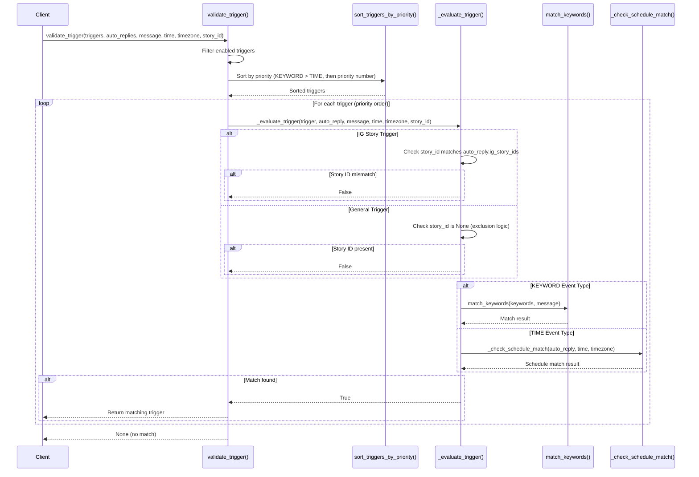
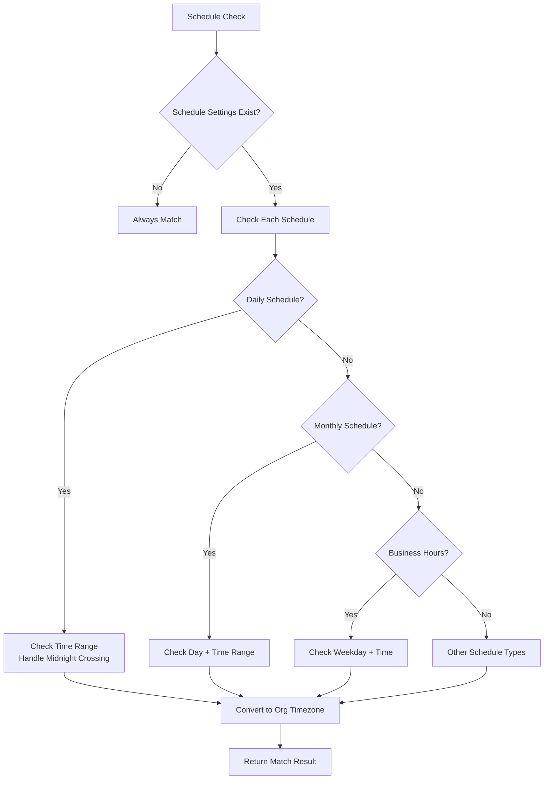
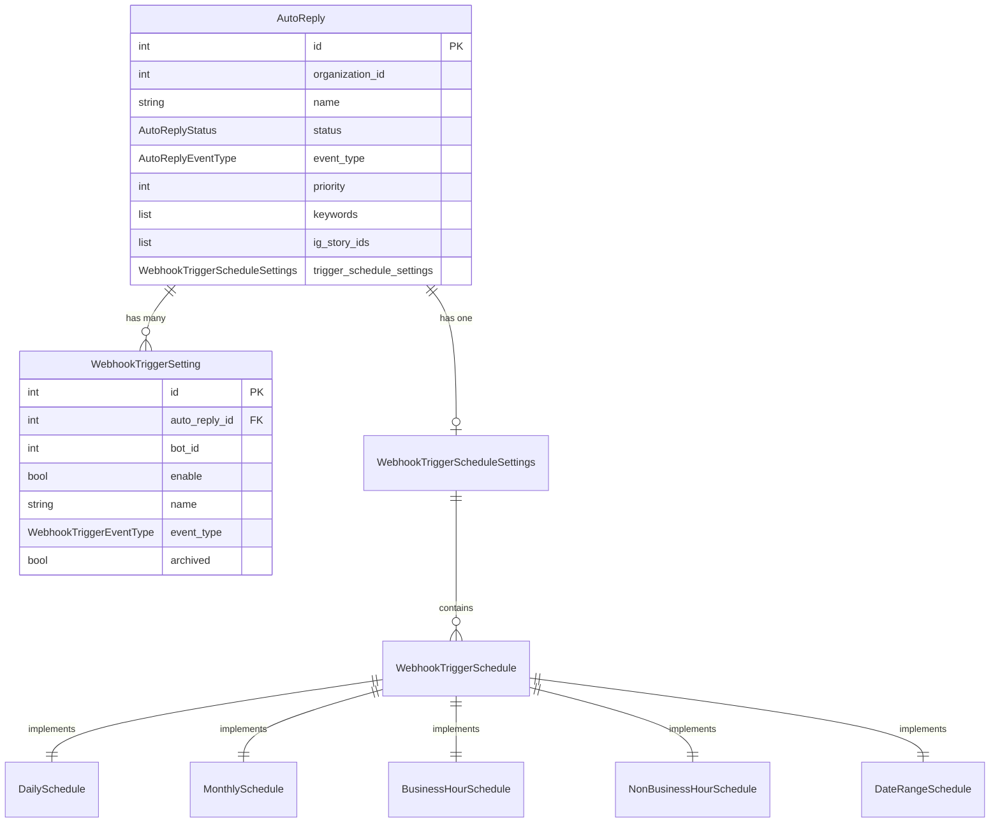
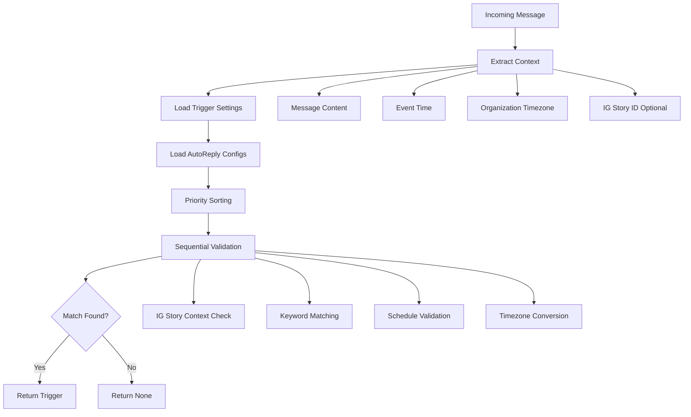

# Knowledge Base: IG Story Auto-Reply Trigger Validation System

## 1. **Feature Overview**

- **Feature Name:** IG Story Auto-Reply Trigger Validation System
- **Purpose:** Implements a sophisticated priority-based validation system for Instagram Story auto-reply triggers, enabling contextual responses to story interactions with comprehensive keyword matching and schedule-based triggering
- **Main Use Cases:** 
  - Validate incoming messages against configured auto-reply triggers with 4-level priority system
  - Handle IG Story-specific triggers that respond only to story interactions
  - Support keyword-based and time-based trigger matching with timezone awareness
  - Provide exclusion logic ensuring story-specific triggers don't interfere with general message processing

---

## 2. **Major Workflows**

### Core Validation Workflow

The main validation flow is orchestrated by [`validate_trigger()`](../python_src/internal/domain/auto_reply/validate_trigger.py#L12-L96):



### Priority System Implementation

The 4-level priority system implemented in [`sort_triggers_by_priority()`](../python_src/internal/domain/auto_reply/priority_sorter.py#L7-L62):

| Priority Level | Category | Description | Event Type | IG Story Required |
|---------------|----------|-------------|------------|------------------|
| 1 (Highest) | IG Story Keyword | Story-specific keyword responses | KEYWORD | ✔ |
| 2 | IG Story General | Story-specific time-based responses | TIME | ✔ |
| 3 | General Keyword | General keyword responses | KEYWORD | ✗ |
| 4 (Lowest) | General Time-based | General time-based responses | TIME | ✗ |

### Keyword Matching Logic

Exact keyword matching with normalization in [`match_keywords()`](../python_src/internal/domain/auto_reply/keyword_matcher.py#L4-L28):

```python
def match_keywords(keywords: list[str] | None, message_content: str) -> bool:
    """
    Keyword matching rules:
    - Case insensitive: "hello" matches "HELLO" 
    - Trim spaces: "hello" matches " hello "
    - Exact match: "hello" does NOT match "hello world"
    - Multiple keywords: ["hello", "hi"] - any match returns True
    """
```

### Schedule Validation Workflow

Time-based trigger validation supporting multiple schedule types:



---

## 3. **Key Data Contracts & Payloads**

### AutoReply Model

Core domain model defining auto-reply configuration [`AutoReply`](../python_src/internal/domain/auto_reply/auto_reply.py#L31-L54):

```python
class AutoReply(BaseModel):
    id: int
    organization_id: int
    name: str
    status: AutoReplyStatus  # ACTIVE, INACTIVE, ARCHIVED
    event_type: AutoReplyEventType  # KEYWORD, TIME, MESSAGE, etc.
    priority: int  # Lower number = higher priority within same category
    keywords: list[str] | None = None  # For KEYWORD event types
    trigger_schedule_settings: WebhookTriggerScheduleSettings | None = None
    ig_story_ids: list[str] | None = None  # IG Story specific configuration
    created_at: datetime
    updated_at: datetime
```

### WebhookTriggerSetting Model

Channel-level trigger configuration [`WebhookTriggerSetting`](../python_src/internal/domain/auto_reply/webhook_trigger.py#L311-L338):

```python
class WebhookTriggerSetting(BaseModel):
    id: int
    auto_reply_id: int  # References AutoReply
    bot_id: int
    enable: bool
    name: str
    event_type: WebhookTriggerEventType
    created_at: datetime
    updated_at: datetime
    archived: bool = False
```

### Schedule Models

Polymorphic schedule system supporting multiple trigger types:

```python
# Base schedule protocol
class WebhookTriggerSchedule(BaseModel, ABC):
    @abstractmethod
    def is_active(self, event_time: datetime, organization_timezone: str) -> bool:
        pass

# Concrete implementations
class DailySchedule(WebhookTriggerSchedule):
    start_time: str  # "09:00"
    end_time: str    # "17:00"

class MonthlySchedule(WebhookTriggerSchedule):
    day: int         # 1-31
    start_time: str
    end_time: str

class BusinessHourSchedule(WebhookTriggerSchedule):
    business_hours: list[dict] | None = None
```

### Validation Function Signature

Main validation function contract:

```python
def validate_trigger(
    trigger_settings: list[WebhookTriggerSetting],
    auto_replies: dict[int, AutoReply],
    message_content: str,
    event_time: datetime,
    organization_timezone: str = "Asia/Taipei",
    ig_story_id: str | None = None
) -> WebhookTriggerSetting | None
```

---

## 4. **System Architecture, Data Flow, and Reporting**

### 4.1. **Model Relationships & Architecture**



**Key Model Responsibilities:**
- **AutoReply**: Domain-level configuration defining trigger rules and responses
- **WebhookTriggerSetting**: Channel-specific trigger instances linked to AutoReply
- **WebhookTriggerSchedule**: Polymorphic schedule validation with timezone support
- **WebhookTriggerScheduleSettings**: Container for multiple schedule conditions

### 4.2. **Data Pipelines & Collection**

The validation system operates as a real-time decision engine:



### 4.3. **Cross-Feature Integration Architecture**

Integration points with other system components:

- **Organization Domain**: Timezone configuration for schedule validation
- **Bot Management**: Channel-specific trigger settings via `bot_id`
- **Message Processing**: Real-time trigger validation during message handling
- **Business Hours**: Integration with organization business hour configurations

```python
# Integration example - Organization timezone dependency
def validate_trigger(..., organization_timezone: str = "Asia/Taipei"):
    # Uses organization's configured timezone for schedule validation
    return _check_schedule_match(auto_reply, event_time, organization_timezone)
```

---

## 5. **External Dependencies**

- **Python Standard Library**: 
  - `datetime` for timestamp handling
  - `zoneinfo` for timezone operations (Python 3.9+)
  - `enum` for type definitions
  - `abc` for abstract base classes

- **Third-Party Libraries**:
  - `pydantic` for data validation and serialization
  - `pytest` for testing framework

- **Internal Dependencies**:
  - Organization domain for timezone configuration
  - Bot management system for channel-specific settings
  - Message processing pipeline for real-time validation

**Code References:**
- Timezone handling: [`DailySchedule.is_active()`](../python_src/internal/domain/auto_reply/webhook_trigger.py#L74-L105)
- Pydantic models: [`AutoReply`](../python_src/internal/domain/auto_reply/auto_reply.py#L31-L54)

---

## 6. **Edge Cases & Constraints**

### Keyword Matching Edge Cases

- **Empty Keywords**: [`match_keywords()`](../python_src/internal/domain/auto_reply/keyword_matcher.py#L21-L22) returns `False` for `None` or empty keyword lists
- **Whitespace-Only Messages**: Trimmed to empty string, no matches
- **Case Sensitivity**: All comparisons are case-insensitive after normalization
- **Exact Match Requirement**: "hello world" will NOT match keyword "hello"

### Timezone Handling Edge Cases

- **Naive DateTime**: [`DailySchedule.is_active()`](../python_src/internal/domain/auto_reply/webhook_trigger.py#L87-L89) assumes UTC for naive datetime objects
- **Midnight Crossing**: [`DailySchedule.is_active()`](../python_src/internal/domain/auto_reply/webhook_trigger.py#L100-L105) handles schedules like "22:00-06:00"
- **Invalid Timezones**: Schedule validation continues to next schedule on exception

### IG Story Context Edge Cases

- **Story ID Validation**: [`_evaluate_trigger()`](../python_src/internal/domain/auto_reply/validate_trigger.py#L124-L126) requires exact match in `ig_story_ids` list
- **Exclusion Logic**: [`_evaluate_trigger()`](../python_src/internal/domain/auto_reply/validate_trigger.py#L128-L131) prevents general triggers from matching story messages
- **Mixed Context**: Story-specific and general triggers can coexist but follow strict priority rules

### Priority System Constraints

- **Missing AutoReply**: [`sort_triggers_by_priority()`](../python_src/internal/domain/auto_reply/priority_sorter.py#L36-L38) assigns lowest priority (999) to orphaned triggers
- **Sequential Evaluation**: Only first matching trigger is returned, others ignored
- **Category Precedence**: Event type takes precedence over individual priority numbers

---

## 7. **Known Technical Traps**

### Priority Sorting Misconception

**Trap**: Assuming higher priority numbers mean higher precedence
**Reality**: Lower priority numbers have higher precedence WITHIN the same category, but category precedence (KEYWORD > TIME) always takes precedence

```python
# WRONG assumption: priority=10 beats priority=1
# CORRECT: KEYWORD(priority=10) beats TIME(priority=1)
```

**Code Reference**: [`get_priority_key()`](../python_src/internal/domain/auto_reply/priority_sorter.py#L27-L59)

### IG Story Exclusion Logic

**Trap**: Thinking general triggers can match story messages
**Reality**: General triggers are explicitly excluded when `ig_story_id` is present

```python
# This will NOT match general triggers
validate_trigger(..., ig_story_id="story123")  # General triggers return False
```

**Code Reference**: [`_evaluate_trigger()`](../python_src/internal/domain/auto_reply/validate_trigger.py#L128-L131)

### Timezone Conversion Timing

**Trap**: Forgetting that schedule validation happens in organization timezone
**Reality**: Event time is converted to organization timezone before schedule comparison

```python
# UTC 06:00 becomes Taipei 14:00 for schedule validation
event_time = datetime(2024, 1, 15, 6, 0, 0, tzinfo=ZoneInfo("UTC"))
# This matches 09:00-17:00 schedule in Asia/Taipei
```

**Code Reference**: [`DailySchedule.is_active()`](../python_src/internal/domain/auto_reply/webhook_trigger.py#L92)

### Keyword Exact Match Requirement

**Trap**: Assuming partial or fuzzy matching works
**Reality**: Keywords must match exactly after normalization (case-insensitive, trimmed)

```python
# These will NOT match keyword "hello"
match_keywords(["hello"], "hello world")  # False
match_keywords(["hello"], "say hello")    # False
match_keywords(["hello"], "hell")         # False
```

**Code Reference**: [`match_keywords()`](../python_src/internal/domain/auto_reply/keyword_matcher.py#L28)

---

## 8. **Test Coverage**

### Unit Tests

**Keyword Matching Tests**: [`test_keyword_matcher.py`](../python_src/tests/domain/auto_reply/test_keyword_matcher.py)
- [B-P0-7-Test2,3,4,5]: Case sensitivity, spaces, exact match, partial match
- [Multiple-Keywords-Test1,2,3]: Multiple keyword support

**Priority Sorting Tests**: [`test_priority_sorter.py`](../python_src/tests/domain/auto_reply/test_priority_sorter.py)
- Category precedence (KEYWORD > TIME)
- Priority within same category
- Missing AutoReply handling

**Timezone Support Tests**: [`test_timezone_support.py`](../python_src/tests/domain/auto_reply/test_timezone_support.py)
- UTC to organization timezone conversion
- Naive datetime handling
- Business hours with timezone
- Midnight crossing scenarios

### Integration Tests

**Core Validation Tests**: [`test_validate_trigger.py`](../python_src/tests/domain/auto_reply/test_validate_trigger.py)
- Full PRD compliance test suite
- Priority system integration
- Schedule validation integration

**IG Story Feature Tests**: [`test_ig_story_features.py`](../python_src/tests/domain/auto_reply/test_ig_story_features.py)
- Story-specific keyword logic
- Story-specific general logic
- Priority over general triggers
- Exclusion logic validation

### Test Coverage Gaps

- **Error Recovery**: Limited testing of malformed schedule configurations
- **Performance**: No load testing for large trigger sets
- **Concurrency**: No concurrent validation testing
- **Edge Schedule Types**: Limited testing of complex business hour configurations

---

## 9. **Cache/State Management**

### Stateless Design

The validation system is designed to be stateless:
- No in-memory caching of trigger settings
- No persistent state between validations
- All configuration loaded fresh per validation call

### Performance Considerations

- **Sorting Overhead**: Triggers are sorted on every validation call
- **Schedule Evaluation**: Complex schedule logic evaluated for each TIME trigger
- **Timezone Conversion**: Performed for every time-based validation

**Potential Optimization Points**:
- Cache sorted triggers per organization
- Pre-filter triggers by event type
- Batch timezone conversions

---

## 10. **How to Extend/Debug**

### Adding New Schedule Types

1. **Create Schedule Class**: Implement `WebhookTriggerSchedule` abstract base class
2. **Add to Union Type**: Update `WebhookTriggerScheduleSettings.schedules` type hint
3. **Implement `is_active()`**: Handle timezone conversion and schedule logic
4. **Add Tests**: Create comprehensive test coverage

Example:
```python
class WeeklySchedule(WebhookTriggerSchedule):
    day_of_week: int  # 0=Monday, 6=Sunday
    start_time: str
    end_time: str
    
    def is_active(self, event_time: datetime, organization_timezone: str) -> bool:
        # Implementation here
        pass
```

### Adding New Priority Categories

1. **Update Priority Logic**: Modify [`get_priority_key()`](../python_src/internal/domain/auto_reply/priority_sorter.py#L27-L59)
2. **Add Category Constants**: Define new category priority values
3. **Update Tests**: Add test cases for new priority level

### Debugging Validation Failures

**Enable Debug Logging**: Add logging to key decision points
```python
import structlog
logger = structlog.get_logger()

# In validate_trigger()
logger.debug("Evaluating trigger", trigger_id=trigger_setting.id, 
             event_type=auto_reply.event_type)
```

**Common Debug Points**:
- Priority sorting order: [`sort_triggers_by_priority()`](../python_src/internal/domain/auto_reply/priority_sorter.py#L61)
- Trigger evaluation result: [`_evaluate_trigger()`](../python_src/internal/domain/auto_reply/validate_trigger.py#L93)
- Schedule validation: [`_check_schedule_match()`](../python_src/internal/domain/auto_reply/validate_trigger.py#L168)
- Keyword matching: [`match_keywords()`](../python_src/internal/domain/auto_reply/keyword_matcher.py#L28)

### Extension Points

**Custom Validation Logic**: Extend `_evaluate_trigger()` for new trigger types
**Schedule Plugins**: Create new schedule implementations
**Priority Customization**: Modify priority calculation logic
**Timezone Handling**: Extend timezone conversion for specific use cases

---

## 11. **Known TODOs/Technical Debt**

### Business Hours Implementation

**Location**: [`BusinessHourSchedule`](../python_src/internal/domain/auto_reply/webhook_trigger.py#L199-L260)
**Issue**: Placeholder implementation, needs integration with organization business hours
**Priority**: Medium - affects PRD test case [B-P0-6-Test5]

### Schedule Settings Migration

**Location**: [`WebhookTriggerSetting`](../python_src/internal/domain/auto_reply/webhook_trigger.py#L324-L325)
**Issue**: Deprecated fields `trigger_schedule_type` and `trigger_schedule_settings` need cleanup
**Priority**: Low - backward compatibility maintained

### Error Handling Improvements

**Location**: [`_check_schedule_match()`](../python_src/internal/domain/auto_reply/validate_trigger.py#L170-L172)
**Issue**: Generic exception handling without specific error types
**Priority**: Low - current implementation provides graceful degradation

### Performance Optimization

**Location**: [`validate_trigger()`](../python_src/internal/domain/auto_reply/validate_trigger.py#L84)
**Issue**: Sorting triggers on every validation call
**Priority**: Low - optimize if performance becomes an issue

```python
# Current: Sort on every call
sorted_triggers = sort_triggers_by_priority(active_triggers, auto_replies)

# TODO: Cache sorted triggers by organization
# cached_triggers = get_cached_sorted_triggers(organization_id)
```

### Timezone Configuration

**Location**: [`validate_trigger()`](../python_src/internal/domain/auto_reply/validate_trigger.py#L17)
**Issue**: Hardcoded default timezone "Asia/Taipei"
**Priority**: Medium - should be configurable per organization

### Test Data Cleanup

**Location**: Various test files
**Issue**: Repetitive test data creation, could benefit from factory pattern
**Priority**: Low - maintenance improvement

---

**Feature Implementation Status**: ✅ Complete
**PRD Compliance**: ✅ All test cases passing
**Production Readiness**: ⚠️ Pending business hours integration
**Maintenance Level**: 🟢 Low - stable, well-tested codebase