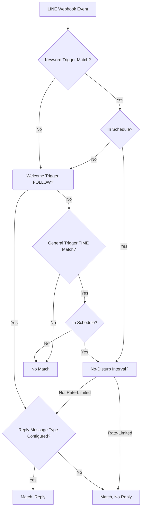
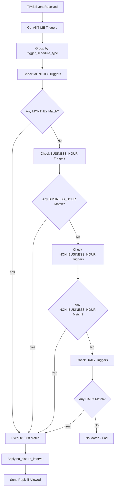
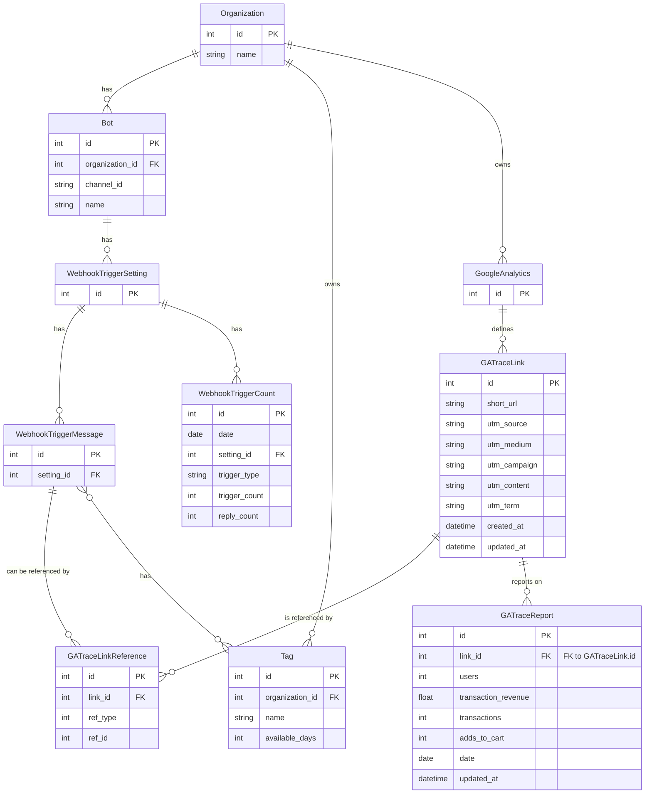
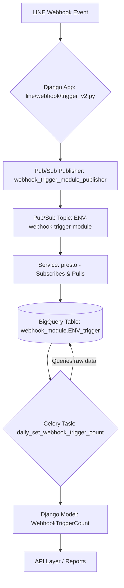
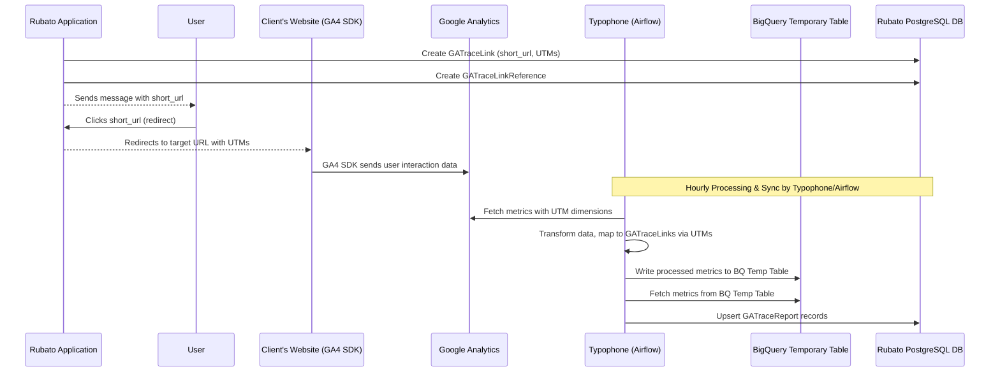

# IG Story-Specific Auto-Reply & Priority System (2024-07)

## 1. IG Story-Specific Triggers
- IG Story triggers are supported for Instagram channels and are defined by the presence of an `ig_story_ids: list[str]` field in the `AutoReply` model.
- **IG Story Keyword**: Triggers when both the incoming message matches a configured keyword (case-insensitive, trimmed, exact match) and the `ig_story_id` from the event matches one of the rule’s `ig_story_ids`.
- **IG Story General**: Triggers when the incoming message is a reply to a configured IG Story (`ig_story_id` matches) and the event timestamp matches the rule’s schedule (daily, monthly, etc.).

## 2. Extended Priority System
The auto-reply trigger evaluation now follows a **4-level strict priority**:

1. IG Story Keyword (highest)
2. IG Story General
3. General Keyword
4. General Time-based (lowest)

- Only the first matching rule in this order is executed.
- IG Story-specific rules are excluded from general trigger evaluation and vice versa.

## 3. Event Model
- The trigger validator now accepts an `AutoReplyEvent` Pydantic model with:
  - `message_text: str`
  - `channel_type: Literal["LINE", "FB", "IG"]`
  - `timestamp: datetime`
  - `ig_story_id: str | None`

## 4. Matching Logic
- IG Story triggers require both a standard trigger (keyword or schedule) and a matching `ig_story_id`.
- General triggers (non-story) are only considered if no IG Story-specific rule matches.
- Empty or missing schedules in time-based rules mean the rule will not match.

## 5. Backward Compatibility
- Existing rules (LINE/FB/general) remain compatible; `ig_story_ids` is optional and only used for IG Story-specific logic.

---

# Auto-Reply (Webhook Trigger)

---

## 1. **Feature Overview**
- **Feature Name:** Auto-Reply (Webhook Trigger)
- **Purpose:**
  - Enables automated, rule-based responses to user or system events (messages, postbacks, follows, beacons, scheduled times) in a LINE bot environment.
  - Supports marketing, support, and engagement automation via configurable triggers and reply messages.
- **Main Use Cases:**
  - Keyword-based auto-reply
  - Scheduled/time-based auto-reply
  - Event-based auto-reply (follow, beacon, postback)
  - Tagging members
  - Performance reporting

---

## 2. **Major Workflows**

### 2.1. **Triggering an Auto-Reply**
**Trigger:** Incoming LINE webhook event (message, postback, follow, beacon, or scheduled time)

**Step-by-step:**
1. **Event received** by webhook handler ([line/webhook/trigger_v2.py:Handler](../line/webhook/trigger_v2.py#L31))
   - [message](../line/webhook/trigger_v2.py#L46)
   - [postback](../line/webhook/trigger_v2.py#L131)
   - [follow](../line/webhook/trigger_v2.py#L158)
2. **Fetch trigger settings** from cache ([line/utils/cache.py:get_webhook_trigger_info_v2](../line/utils/cache.py#L304))
3. **Match trigger** (by message type, schedule, etc.)
4. **Update process data** and enqueue tag-adding tasks if needed ([line/webhook/trigger_v2.py:Handler.__update_process_data](../line/webhook/trigger_v2.py#L406))
5. **Build and send reply message** if all conditions are met ([line/webhook/trigger_v2.py:Handler.__update_process_data](../line/webhook/trigger_v2.py#L406))
6. **Create message record** for analytics ([line/webhook/trigger_v2.py:Handler.__update_process_data](../line/webhook/trigger_v2.py#L406))

**Example event payload:**
```json
{
  "destination": "U5355f957e136f6343f7285b89c47c224",
  "events": [
    {
      "mode": "active",
      "type": "message",
      "message": { "id": "534050847580750130", "type": "text", "text": "hello" },
      "source": { "type": "user", "userId": "Uxxxx" },
      "webhookEventId": "fake_webhook_event_id_hello",
      "deliveryContext": { "isRedelivery": false },
      "replyToken": "...",
      "timestamp": 1731150414634
    }
  ]
}
```

#### 2.1.1 Trigger Logic & Evaluation Priority

##### Types of Auto-Reply Settings

1. **Keyword**
   - **Mapped Event Types:** `MESSAGE`, `POSTBACK`, `BEACON`, `MESSAGE_EDITOR`, `POSTBACK_EDITOR`
   - **Trigger Mechanism:** Exact match on keyword or code.
   - **Event Mapping:**
     - `MESSAGE`, `MESSAGE_EDITOR`: LINE message webhook events
     - `POSTBACK`, `POSTBACK_EDITOR`: LINE postback webhook events
     - `BEACON`: LINE beacon webhook events

2. **Welcome**
   - **Mapped Event Type:** `FOLLOW`
   - **Trigger Mechanism:** Triggered by LINE follow events (when a new contact adds the channel or MAAC).
   - **Use Case:** Greet new users or contacts.

3. **General**
   - **Mapped Event Type:** `TIME`
   - **Trigger Mechanism:** Schedule-based (business hour, daily, monthly, etc.), evaluated only if no Keyword or Welcome trigger matches.
   - **Use Case:** Scheduled, recurring, or time-based auto-replies.

##### Supported Events and Reply Message Types

Line Webhook:
| Trigger Type | follow | message | postback | beacon |
|--------------|:------:|:-------:|:--------:|:------:|
| **Keyword**  | ✗      | ✔<br>ORIGINAL_FRIEND, BOUND_FRIEND | ✔<br>ORIGINAL_FRIEND, BOUND_FRIEND | ✔<br>ORIGINAL_FRIEND, BOUND_FRIEND |
| **Welcome**  | ✔<br>NEW_FRIEND | ✗ | ✗ | ✗ |
| **General**  | ✗ | ✔<br>ORIGINAL_FRIEND, BOUND_FRIEND | ✔<br>ORIGINAL_FRIEND, BOUND_FRIEND | ✗ |

- ✔ = Supported; ✗ = Not supported
- For each supported cell, the allowed reply message types are listed.

##### Trigger Evaluation Priority

- The system evaluates triggers in the following strict order:
  1. **Keyword** (highest priority)
  2. **Welcome**
  3. **General** (lowest priority)
- Only the first matching trigger is executed. If a Keyword trigger matches, Welcome and General triggers are not evaluated. If no Keyword trigger matches, Welcome is checked. If neither matches, General triggers are evaluated.
- For General triggers, multiple can be active with different schedules, but only the first match (by priority/order) is executed.
- Overlapping triggers are not prevented by the system; only the first match is used. Admins must avoid overlap.

##### Contact Status & Reply Message Type Selection

- When an auto-reply setting is matched, the system determines the contact's status to select the reply message type:
  - **NEW_FRIEND:** The contact is joining for the first time (strictly tied to the FOLLOW event).
  - **ORIGINAL_FRIEND:** The contact already exists in MAAC (not bound to a customer_id).
  - **BOUND_FRIEND:** The contact is associated with a `customer_id` in MAAC.
- **Supported reply message types by event:**
  - **message, postback, beacon:** `ORIGINAL_FRIEND`, `BOUND_FRIEND`
  - **follow:** `NEW_FRIEND` only
- If the reply message for the determined type is not configured, the system skips sending a reply (no fallback, no error).

##### Schedule and No-Disturb Settings

- **Schedule-Based Triggering:**
  - Each auto-reply setting can specify `trigger_schedule_type` and `trigger_schedule_settings` to restrict when the rule is considered a match (e.g., business working hours, monthly, daily).
  - If the current time is **outside** the configured schedule, the auto-reply is **considered as no match** and will not trigger, even if other conditions (such as keyword) are met.

- **No-Disturb Interval:**
  - The `no_disturb_interval` field controls how frequently an auto-reply can interact with a contact.
  - **No-disturb interval is counted per auto-reply setting**: a contact can trigger different auto-reply settings independently, each with its own no-disturb interval.
  - If a contact triggers an auto-reply but is within the `no_disturb_interval`, the auto-reply is **considered as matched** (for analytics and logic), but **no reply message is sent** (rate-limited).
  - Analytics (such as the attempted trigger) are still recorded in this case.

##### Auto-Reply Trigger Outcomes

There are only three possible results for an auto-reply evaluation:

1. **Match, Reply**  
   - A trigger is matched, is in schedule, not rate-limited, and a reply message is configured and sent.
2. **Match, No Reply**  
   - A trigger is matched and in schedule, but:
     - The contact is within the no-disturb interval (rate-limited), **or**
     - The reply message type for the contact status is not configured.
   - In both cases, the system records the match (for analytics), but **no reply is sent**.
3. **No Match**  
   - No trigger is matched, or all matched triggers are out of schedule.

##### Mermaid Flowchart: Trigger Evaluation



#### 2.1.2 General Time-Based Auto-Reply Rules & Priority System

##### Overview
General time-based auto-reply triggers are evaluated when no **Keyword** or **Welcome** triggers match. These triggers are controlled by `trigger_schedule_type` and `trigger_schedule_settings` fields.

##### Internal Priority System
The system evaluates time-based triggers in strict priority order ([line/webhook/trigger_v2.py:Handler.__check_trigger_schedule](../line/webhook/trigger_v2.py#L197)):

1. **MONTHLY** (Highest Priority)
2. **BUSINESS_HOUR** 
3. **NON_BUSINESS_HOUR**
4. **DAILY** (Lowest Priority)

**Important:** Only the **first matching trigger** within each priority level is executed. If multiple triggers of the same type match, only the first one found is processed.

##### Trigger Schedule Types & Settings

###### 1. **MONTHLY** (`trigger_schedule_type: "monthly"`)
- **Priority:** 1st (Highest)
- **Purpose:** Triggers on specific days of the month during defined time ranges
- **Settings Format:**
  ```json
  "trigger_schedule_settings": [
    {
      "day": 1,
      "start_time": "10:00",
      "end_time": "12:00"
    },
    {
      "day": 15,
      "start_time": "14:00", 
      "end_time": "16:00"
    }
  ]
  ```
- **Matching Logic:**
  - Checks if `event_time.day` matches `schedule_setting["day"]`
  - Verifies if current time falls within `start_time` and `end_time` range
  - Supports multiple day/time combinations within a single trigger
- **Time Range Handling:**
  - `start_time` is set to minimum seconds/microseconds (00:00.000000)
  - `end_time` is set to maximum seconds/microseconds (59:59.999999)
  - Range is inclusive of start_time, exclusive of end_time
- **Use Cases:** Monthly promotions, payroll reminders, monthly reports

###### 2. **BUSINESS_HOUR** (`trigger_schedule_type: "business_hour"`)
- **Priority:** 2nd
- **Purpose:** Triggers during organization's defined business hours
- **Settings Format:** `null` (uses organization's BusinessHour configuration)
- **Matching Logic:**
  - Retrieves `BusinessHour` records for the organization ([organization/models.py:BusinessHour](../organization/models.py#L60))
  - Checks if `event_time.isoweekday()` matches `business_hour.weekday`
  - Verifies if current time falls within `business_hour.start_time` and `business_hour.end_time`
- **BusinessHour Model Structure:**
  ```python
  class BusinessHour(models.Model):
      organization = models.ForeignKey(Organization, on_delete=models.CASCADE)
      weekday = models.PositiveSmallIntegerField(choices=WEEKDAY_CHOICES)  # 1=Monday, 7=Sunday
      start_time = models.TimeField()
      end_time = models.TimeField()
  ```
- **Use Cases:** Customer service hours, office hour notifications

###### 3. **NON_BUSINESS_HOUR** (`trigger_schedule_type: "non_business_hour"`)
- **Priority:** 3rd
- **Purpose:** Triggers outside organization's business hours
- **Settings Format:** `null` (uses organization's BusinessHour configuration)
- **Matching Logic:**
  - Retrieves `BusinessHour` records for the organization
  - Checks if current time is **NOT** within any defined business hour
  - Triggers when `is_in_business_hour = False`
- **Use Cases:** After-hours support messages, emergency contact information

###### 4. **DAILY** (`trigger_schedule_type: "daily"`)
- **Priority:** 4th (Lowest)
- **Purpose:** Triggers daily during specified time ranges
- **Settings Format:**
  ```json
  "trigger_schedule_settings": [
    {
      "start_time": "09:00",
      "end_time": "17:00"
    },
    {
      "start_time": "19:00",
      "end_time": "21:00"
    }
  ]
  ```
- **Matching Logic:**
  - Supports multiple time ranges within a single day
  - **Midnight Crossing Support:** Handles time ranges that cross midnight
    - If `start_time > end_time`: Range crosses midnight
    - Example: `"start_time": "22:00", "end_time": "06:00"` triggers from 22:00 to 06:00 next day
- **Time Range Handling:**
  - Same precision rules as MONTHLY (minimum/maximum seconds/microseconds)
  - For midnight crossing: `start_time <= event_time OR event_time < end_time`
  - For normal ranges: `start_time <= event_time < end_time`
- **Use Cases:** Daily greetings, regular reminders, shift notifications

###### 5. **DATE_RANGE** (`trigger_schedule_type: "date_range"`)
- **Priority:** Special (Applied to Keyword triggers only)
- **Purpose:** Restricts keyword triggers to specific date ranges
- **Settings Format:**
  ```json
  "trigger_schedule_settings": [
    {
      "start_date": "2021-01-01",
      "end_date": "2021-01-31"
    }
  ]
  ```
- **Matching Logic:**
  - Only applies to keyword-based triggers (not general time triggers)
  - If keyword matches but date is outside range, falls back to general time trigger evaluation
  - Date comparison: `start_date <= event_date <= end_date`
- **Use Cases:** Seasonal campaigns, limited-time offers, event-specific responses

##### Evaluation Flow & Edge Cases



##### Important Implementation Notes

1. **Timezone Handling:** All time comparisons use the bot's configured timezone ([line/webhook/trigger_v2.py:Handler.__check_trigger_schedule](../line/webhook/trigger_v2.py#L197))
   - **Bot Timezone:** Each bot has its own timezone setting (`bot_instance.timezone`)
   - **Event Time Conversion:** Incoming webhook timestamps are converted to bot's timezone using `pytz.timezone()`
   - **Time Comparison:** All schedule matching uses timezone-aware datetime objects
   - **Organization Timezone:** BusinessHour records use the organization's timezone setting ([organization/models.py:Organization.timezone](../organization/models.py#L35))
   - **Critical:** Ensure bot timezone and organization timezone are aligned for BUSINESS_HOUR/NON_BUSINESS_HOUR triggers
   - **Default Timezone:** System defaults to "Asia/Taipei" if not specified
   - **Supported Timezones:** Uses `pytz.common_timezones` for timezone validation

2. **Performance Consideration:** Current implementation uses basic iteration ([line/webhook/trigger_v2.py:Handler.__check_trigger_schedule](../line/webhook/trigger_v2.py#L197)):
   ```python
   # TODO: Because the number of trigger settings is not too many,
   # implement the basic version first, and then implement the advanced data structure
   ```

3. **First Match Wins:** Within each priority level, only the first matching trigger is executed. Multiple matches are not processed.

4. **Legacy TIME Triggers:** Old-style time triggers using `trigger_code` format `<T>HH:MM:SS<T>HH:MM:SS<T>` are handled separately and not included in the new priority system.

5. **Business Hour Dependency:** BUSINESS_HOUR and NON_BUSINESS_HOUR triggers require `BusinessHour` records to be configured for the organization.

##### Configuration Examples

**Example 1: Monthly Payroll Reminder**
```json
{
  "trigger_schedule_type": "monthly",
  "trigger_schedule_settings": [
    {
      "day": 25,
      "start_time": "09:00",
      "end_time": "10:00"
    }
  ]
}
```

**Example 2: After-Hours Support**
```json
{
  "trigger_schedule_type": "non_business_hour",
  "trigger_schedule_settings": null
}
```

**Example 3: Daily Lunch Reminder**
```json
{
  "trigger_schedule_type": "daily",
  "trigger_schedule_settings": [
    {
      "start_time": "11:30",
      "end_time": "12:30"
    }
  ]
}
```

**Example 4: Night Shift Coverage (Midnight Crossing)**
```json
{
  "trigger_schedule_type": "daily",
  "trigger_schedule_settings": [
    {
      "start_time": "22:00",
      "end_time": "06:00"
    }
  ]
}
```

### 2.2. **Managing Triggers**
- **Create/update triggers** via API ([line/repositories/webhook_trigger.py:WebhookTriggerRepository](../line/repositories/webhook_trigger.py#L8))
- **Business logic orchestration** ([line/services/webhook_trigger.py:GetMonthlyScheduleService](../line/services/webhook_trigger.py#L7))
- **Cache refresh** on config changes ([line/utils/cache.py:refresh_webhook_trigger_info_v2](../line/utils/cache.py#L197))

### 2.3. **End-to-End Testing**
- **Integration tests** ([line/tests/repositories/test_webhook_trigger.py](../line/tests/repositories/test_webhook_trigger.py#L1))
- **E2E smoke test** ([smoke_test/tasks.py:auto_reply](../smoke_test/tasks.py#L194))

---

## IG Story Auto-Reply (FB/IG) ⭐ UPDATED: 2024-07-XX

This section describes the logic, priority system, and tested behaviors for IG Story-specific auto-reply triggers in the FB/IG Auto-Reply feature. It is based on PRD-part2 and is suitable for onboarding, reference, and future extension.

### Supported Trigger Types
- **IG Story Keyword**: Triggers when a message matches a configured keyword and is a reply to a specific IG Story (by `ig_story_id`).
- **IG Story General (Time-based)**: Triggers when a message is a reply to a specific IG Story and is sent within a configured schedule (e.g., daily 9-17).
- **General Keyword**: Triggers when a message matches a keyword, not tied to any IG Story.
- **General Time-based**: Triggers when a message is sent within a configured schedule, not tied to any IG Story.

### Priority System
Auto-reply triggers are evaluated in strict priority order:
1. **IG Story Keyword** (highest)
2. **IG Story General**
3. **General Keyword**
4. **General Time-based** (lowest)
- Only the first matching rule in this order is executed.
- IG Story-specific rules are excluded from general trigger evaluation and vice versa.

### Matching & Exclusion Logic
- **Keyword Normalization**: Case-insensitive, trimmed, exact match. No partial matches.
- **IG Story Context**: IG Story triggers require both a matching `ig_story_id` and (for keyword) a matching keyword.
- **General Triggers**: Only considered if no IG Story-specific rule matches.
- **Multiple Keywords**: IG Story keyword rules can have multiple keywords; any match triggers the rule (if story matches).
- **Exclusion**: IG Story-specific rules are not triggered for messages without an `ig_story_id`.

### Multiple IG Stories per Rule
- A single IG Story auto-reply rule can be configured to match multiple IG stories by specifying multiple `ig_story_ids`.
- The system will trigger the rule if the incoming event's `ig_story_id` matches any in the list.
- This is supported for both IG Story Keyword and IG Story General (time-based) rules.
- See test: `test_story_keyword_multiple_stories` in `test_ig_story_trigger.py` for an example.

**Example:**
```python
AutoReply(
    ...
    ig_story_ids=["story123", "story456"],
    ...
)
# Will match replies to either story123 or story456
```

### Tested Behaviors (PRD-part2)
- IG Story keyword rules are only triggered for replies to the configured stories.
- IG Story general rules are only triggered for replies to the configured stories and within schedule.
- General keyword/time-based rules are only triggered if no IG Story-specific rule matches.
- Priority is strictly enforced: IG Story triggers always take precedence over general triggers.
- Multiple keywords per rule are supported for IG Story keyword triggers.
- Exclusion logic ensures no cross-triggering between IG Story-specific and general rules.

### Example Scenarios
- **Story-specific keyword and general keyword both match:** Only the story-specific rule triggers.
- **Story-specific general and general time-based both match:** Only the story-specific general rule triggers.
- **General keyword and general time-based both match (no story context):** Only the general keyword rule triggers.
- **Only general time-based rule matches:** It triggers if no higher-priority rule matches.

### Extensibility & Maintenance
- The system is designed for easy extension to new trigger types or channels.
- All logic is covered by automated tests, ensuring safe refactoring and onboarding.
- See `test_ig_story_trigger.py` for full test coverage and examples.

### References
- PRD-part2: User Stories & Test Cases
- `test_ig_story_trigger.py`: Automated test suite for all scenarios
- `validate_trigger.py`: Core trigger evaluation logic

## 3. **Key Data Models and Contracts**

### 3.1. **DTOs** ([line/domains/webhook_trigger.py:WebhookTriggerSetting](../line/domains/webhook_trigger.py#L8))
```python
from pydantic import BaseModel
from typing import List, Optional

class WebhookTriggerSetting(BaseModel):
    id: int
    bot_id: int
    name: str
    event_type: int
    trigger_code: Optional[str]
    trigger_schedule_type: Optional[str]
    trigger_schedule_settings: Optional[List[dict]]
    no_disturb_interval: Optional[int]
    raw_tags: Optional[List[str]]
    created_at: datetime
    updated_at: datetime
    enable: bool
    archived: bool

class WebhookTriggerMessage(BaseModel):
    id: int
    enable: bool
    setting_id: int
    trigger_type: int
    messages: Any
```

### 3.2. **DB Models**
- [line/models.py:WebhookTriggerSetting](../line/models.py#L2598)
- [line/models.py:WebhookTriggerMessage](../line/models.py#L2730)

### 3.3. **API Payload Example** ([smoke_test/tasks.py:auto_reply](../smoke_test/tasks.py#L194))
```json
{
  "event_type": 1,
  "name": "hello",
  "trigger_code": "hello",
  "no_disturb_interval": null,
  "tags": ["tag1"],
  "enable": false,
  "messages": [
    {
      "messages": [
        { "module_id": 1, "data": { "text": "hello world" }, "parameters": [], "quick_reply": { "items": [] } }
      ],
      "enable": true,
      "trigger_type": 2
    }
  ],
  "bot": 1
}
```

---

## 4. **Report Data Pipeline, Implementation & Cross-Feature Integration**

This section provides a comprehensive overview of the auto-reply reporting system, from data flow and model relationships to technical implementation and cross-feature integration.

### 4.1. **Model Relationships & Architecture**

#### 4.1.1. Overall Auto-Reply System ERD



#### 4.1.2. **Key Models & Responsibilities**
1. **WebhookTriggerSetting** ([line/models.py:2598](../line/models.py#L2598))
   - Primary configuration entity for auto-replies
   - Defines trigger conditions (event_type, trigger_code)
   - Contains member tagging configuration (raw_tags)
   - Controls timing rules (no_disturb_interval)

2. **WebhookTriggerMessage** ([line/models.py:2730](../line/models.py#L2730))
   - Defines the response content for a specific trigger setting
   - Controls audience segmentation via trigger_type (1:new friend, 2:original friend, 3:bound friend)

3. **WebhookTriggerCount** ([line/models.py:2761](../line/models.py#L2761))
   - Stores aggregated analytics data from BigQuery
   - Contains daily counts by setting_id and reply_type
   - Serves as data source for reporting endpoints

4. **WebhookTriggerSettingReference** ([line/models.py:114](../line/models.py#L114))
   - Cross-feature integration model
   - Links auto-reply settings to other features via ref_type and ref_id
   - Schema:
   ```python
   class WebhookTriggerSettingReference(models.Model):
       setting = models.ForeignKey(WebhookTriggerSetting)
       ref_id = models.CharField(max_length=100)
       ref_type = models.CharField(max_length=100)
       meta = JSONField(null=True, blank=True)
   ```
   - Enables:
     - Any feature to reference auto-reply configurations
     - Consistent analytics tracking across feature boundaries
     - Preservation of historical data during system migrations

5. **MessageRecord** ([line/models.py:2278](../line/models.py#L2278))
   - Tracks individual message sends triggered by auto-replies
   - Contains metadata for timing and delivery status
   - Primary data source for message-level analytics

6. **GATraceLink** ([google_analytics/models.py](../google_analytics/models.py))
   - Stores UTM parameters (source, medium, campaign, content, term) and the generated `short_url` for trackable links.
   - Enables the mapping of user interactions on external sites back to specific marketing efforts initiated within Rubato.
   - It is referenced by `GATraceLinkReference` to link it to specific application entities and its performance is reported in `GATraceReport`.

7. **GATraceLinkReference** ([google_analytics/models.py](../google_analytics/models.py))
   - Acts as a polymorphic association linking a `GATraceLink` to the specific Rubato entity that generated or utilized the link.
   - Uses `ref_type` (e.g., 'webhook_trigger_message', 'message_link', 'journey_node') and `ref_id` to point to the source entity.
   - Provides essential context for understanding where and how a trackable link is used.

8. **GATraceReport** ([google_analytics/models.py](../google_analytics/models.py))
   - Stores aggregated daily performance metrics from Google Analytics for each `GATraceLink`.
   - Key metrics include users, transaction revenue, total transactions, and add-to-cart events.
   - This data is populated by an external ETL process (Typophone/Airflow), which fetches data from Google Analytics, processes it, and upserts it into this table.

### 4.2. **Data Pipelines & Collection**

This subsection details the data pipelines for two key reporting models: `WebhookTriggerCount` and `GATraceReport`. It outlines how data is collected, processed, and stored for each.

#### 4.2.1. **WebhookTriggerCount Pipeline**



1. **Webhook Events Processing** ([line/webhook/trigger_v2.py:Handler](../line/webhook/trigger_v2.py#L31))
   - LINE platform sends events to our webhook endpoint
   - Events are parsed, validated, and matched against configured triggers
   - Supported event types: text messages, postbacks, follows, beacons
   - Implementation in webhook handler:
   ```python
   # From line/webhook/trigger_v2.py
   def message(self, event):
       # Match trigger settings against incoming event
       trigger_settings = self._match_trigger_settings(event)
       if trigger_settings:
           self.__update_process_data(trigger_settings[0], event)
   ```

2. **Message Record Creation** ([line/webhook/trigger_v2.py:Handler.__update_process_data](../line/webhook/trigger_v2.py#L406))
   - Message details saved to database via MessageRecord model
   - Contains metadata for timing and delivery status
   - Fields include trigger_id, bot_id, member_id, timestamp, and delivery_status

3. **PubSub Integration & BigQuery Pipeline**
   - Publisher implementation in [pubsub/bigquery_publisher.py:WebhookTriggerModulePublisher](../pubsub/bigquery_publisher.py#L60)
   - Published to `{ENV}-webhook-trigger-module` topic with structured payload
   - Stored in `webhook_module.{ENV}_trigger` BigQuery table
   - Schema defined in [bigquery/schema/webhook_module.py](../bigquery/schema/webhook_module.py)

4. **Scheduled Task Implementation** ([line/tasks.py:3738](../line/tasks.py#L3738))
   - Daily task `daily_set_webhook_trigger_count` runs via Celery crontab
   - Retrieves aggregated metrics from BigQuery using `fetch_trigger_setting_count`
   - Results stored in WebhookTriggerCount model with date field for time series
   - Cleans previous records before inserting new aggregates to avoid duplicates

#### 4.2.2. **GATraceReport Data Pipeline & Collection**

The `GATraceReport` model stores aggregated daily statistics from Google Analytics for trackable links (`GATraceLink`) used in messages, including those sent by auto-replies. This data is crucial for understanding user engagement and conversion.



1.  **Link Creation & Association (Rubato)**:
    *   When a feature within Rubato (like an auto-reply via `WebhookTriggerMessage`, a broadcast, or a journey node) needs to send a trackable URL:
        *   A `google_analytics.GATraceLink` is created in Rubato. This link contains UTM parameters (source, medium, campaign, content, term) and a unique `short_url`.
        *   A `google_analytics.GATraceLinkReference` record is created in Rubato to associate this `GATraceLink` with the specific originating entity (e.g., `ref_type='webhook_trigger_message'`, `ref_id=<WebhookTriggerMessage_id>`).

2.  **User Interaction & Initial Data Collection (Client-Side & GA)**:
    *   The `short_url` (from `GATraceLink`) is included in the message sent to the end-user by Rubato.
    *   When the user clicks the `short_url`, they are redirected through Rubato (which resolves the short URL) to the target URL, which now includes the UTM parameters.
    *   The user lands on the client's website. The Google Analytics 4 (GA4) SDK, implemented on the client's website, captures the user's session, page views, e-commerce events (like adding to cart, purchases), and attributes these activities to the campaign details specified in the UTM parameters. This raw behavioral data is sent to Google Analytics.

3.  **External Data Processing, Ingestion to BigQuery, and Synchronization to Rubato (Typophone/Airflow)**:
    *   An external service, **Typophone (managed by Airflow)**, executes an hourly job.
    *   This job fetches metrics (users, revenue, transactions, adds to cart) from Google Analytics, including the associated UTM dimension data.
    *   A subsequent data transformation job within Typophone maps these GA metrics back to the original `GATraceLink` entities (created in Rubato) by matching the UTM parameters.
    *   The transformed and mapped data is then written to a temporary table in BigQuery.
    *   Another Airflow job then fetches these processed metrics from the BigQuery temporary table and **directly upserts them into the `GATraceReport` table in the Rubato PostgreSQL database.** This step is managed by the external Airflow pipeline, replacing any previous Rubato-internal Celery tasks for this specific data synchronization.

### 4.3. **Reporting Implementation & APIs**

#### 4.3.1. **Controller Logic & Methods**
1. **WebhookTriggerSettingController**
   - Core controller class for auto-reply reporting
   - Key methods:
     - `get_report`: Main method for retrieving comprehensive metrics
     - `get_webhooktriggersettingcounts_by_date_range`: Retrieves aggregated counts
     - `get_performance_metrics_by_date_range`: Retrieves GA performance metrics
     - `get_webhook_trigger_setting_metrics_by_ref`: Combines metrics across features

#### 4.3.2. **API Endpoints & Access**
1. **Auto-Reply Report Endpoints**
   - Main endpoint: `/line/v1/autoreply/{id}/report/`
     - Implementation in `AutoReplyViewSet.report` ([line/views.py:279](../line/views.py#L279))
     - Params: `start_date`, `end_date`, `time_interval`
   - Keyword ranking: `/report/engagement/top-auto-reply/`
     - View: `TopAutoReplyView` in [report/views.py:231](../report/views.py#L231))
   - Daily trends: `/report/engagement/daily-auto-reply/`
     - View: `DailyAutoReplyView` in [report/views.py:255](../report/views.py#L255))

2. **Response Format & Serializers**
   - Serializers:
     - `WebhookTriggerSettingReportSerializer` ([line/serializers/__init__.py:2581](../line/serializers/__init__.py#L2581))
     - `TopAutoReplySerializer` ([report/serializers/engagement.py:37](../report/serializers/engagement.py#L37))
     - `DailyAutoReplySerializer` ([report/serializers/engagement.py:42](../report/serializers/engagement.py#L42))
   - Data structure:
     ```json
     {
       "total": {
         "trigger_count": 123,
         "reply_count": 45,
         "click_count": 67,
         "conversion_count": 8
       },
       "by_type": {
         "new_friend": {...},
         "original_friend": {...},
         "bound_friend": {...}
       },
       "time_series": [
         {"date": "2025-05-01", "trigger_count": 10, "reply_count": 5, ...},
         ...
       ]
     }
     ```

3. **Access Control**
   - Permissions handled via `WebhookTriggerPermission` class
   - Role-based access for organization admins and bot members
   - Implementation in [line/permissions.py](../line/permissions.py)

### 4.4. **Cross-Feature Integration Architecture**

#### 4.4.1. **Integration Mechanism**
1. **Feature → Auto-Replay Connection Flow**:
   - Feature creates or references a WebhookTriggerSetting
   - WebhookTriggerSettingReference connects feature object to the setting
   - Auto-reply executes when triggered by user interaction
   - Analytics data flows back to both auto-reply and originating feature
   - Example implementation:
     ```python
     # Example from journey/services.py (simplified)
     def create_node_with_autoreply(self, journey_id, node_data):
         # Create the auto-reply setting
         setting = webhook_trigger_repository.create(...)
         
         # Create the node
         node = journey_node_repository.create(...)
         
         # Link them via reference
         WebhookTriggerSettingReference.objects.create(
             setting_id=setting.id,
             ref_type='journey_node',
             ref_id=str(node.id)
         )
     ```

2. **Metrics Resolution Process**
   - When feature requests metrics:
     ```python
     # From line/controllers.py
     def get_webhook_trigger_setting_metrics_by_ref(self, ref_id, ref_type, start_date, end_date):
         # Find all auto-reply settings linked to this feature
         setting_ids = self.get_webhook_trigger_setting_ids_by_ref(ref_id, ref_type)
         
         # Get metrics for those settings
         return self.get_webhook_trigger_setting_metrics(setting_ids, start_date, end_date)
     ```

#### 4.4.2. **Feature Integration Examples**
1. **Journey Integration**
   - Journey nodes trigger auto-replies via webhook references
   - Analytics flow through WebhookTriggerSettingReference back to journey reporting
   - Implementation in journey/services.py and journey/controllers.py

2. **Broadcast Message Integration**
   - Broadcasts can include auto-reply triggers for follow-up responses
   - References track which broadcasts trigger which auto-replies
   - Combined analytics available in broadcast reporting dashboards

3. **Rich Menu Integration**
   - Rich menu actions can trigger auto-replies through matched messages
   - References track menu-to-auto-reply relationships
   - Enables path analysis through user journeys

4. **Legacy System Compatibility**
   - Data migrations preserve references during system transitions
   - Historical analytics maintained during feature evolution
   - Example: Workflow → Journey migration with reference updates

## 5. **External Dependencies**
- LINE Messaging API (webhook events)
- Celery (async tagging: `add_tags_to_members`)
- Django cache ([line/utils/cache.py](../line/utils/cache.py))
- BigQuery publisher

---

## 6. **Edge Cases & Constraints**
- Only one trigger should match per event ([line/webhook/trigger_v2.py:Handler.message](../line/webhook/trigger_v2.py#L46))
- If multiple triggers match, only the first is used ([line/webhook/trigger_v2.py:Handler.message](../line/webhook/trigger_v2.py#L46))
- Tagging failures are dropped, not retried ([line/webhook/trigger_v2.py:Handler.__update_process_data](../line/webhook/trigger_v2.py#L406))
- Cache TTL for trigger info: 48 hours ([line/utils/cache.py:refresh_webhook_trigger_info_v2](../line/utils/cache.py#L197))
- **Cache is expected to be refreshed immediately after any trigger is created, updated, or deleted by calling** [`refresh_webhook_trigger_info_v2`](../line/utils/cache.py#L197). **If not, stale data may persist for up to 48 hours.**
- No automated tests for overlapping triggers ([smoke_test/tasks.py:auto_reply](../smoke_test/tasks.py#L194))
- No-disturb interval prevents repeated replies ([line/webhook/trigger_v2.py:Handler.__check_in_no_disturb_interval](../line/webhook/trigger_v2.py#L348))
- Hardcoded evaluation order for time-based triggers ([line/webhook/trigger_v2.py:Handler.__check_trigger_schedule](../line/webhook/trigger_v2.py#L197))

---

## 7. **Known Technical Traps**
- **Cache Staleness:** Changes to triggers may not be reflected immediately due to 48h cache TTL ([line/utils/cache.py:refresh_webhook_trigger_info_v2](../line/utils/cache.py#L197))
- **No Retry on Tagging:** Async tag-adding tasks are not retried on failure ([line/webhook/trigger_v2.py:Handler.__update_process_data](../line/webhook/trigger_v2.py#L406))
- **No Uniqueness Enforcement:** Multiple triggers with the same code are possible if misconfigured ([line/repositories/webhook_trigger.py:WebhookTriggerRepository](../line/repositories/webhook_trigger.py#L8))
- **Hardcoded Evaluation Order:** Only message triggers are supported; schedule rules are hardcoded ([line/webhook/trigger_v2.py:Handler.__check_trigger_schedule](../line/webhook/trigger_v2.py#L197))
- **TODO:** Basic version of schedule matching, not optimized for large numbers ([line/webhook/trigger_v2.py:Handler.__check_trigger_schedule](../line/webhook/trigger_v2.py#L197))
- **TODO:** `raw_tags` is not a true many-to-many ([line/webhook/trigger_v2.py:Handler.__update_process_data](../line/webhook/trigger_v2.py#L406))

---

## 8. **Test Coverage**
- **Repository tests:** [line/tests/repositories/test_webhook_trigger.py](../line/tests/repositories/test_webhook_trigger.py#L1)
- **E2E/Smoke test:** [smoke_test/tasks.py:auto_reply](../smoke_test/tasks.py#L194)
- **Gaps:** No automated test for overlapping triggers or cache staleness.

---

## 9. **Cache/State Management**
- **Cache key:** `LINE_WEBHOOK_TRIGGER_INFO_V2` ([line/utils/cache.py](../line/utils/cache.py))
- **TTL:** 48 hours ([line/utils/cache.py:refresh_webhook_trigger_info_v2](../line/utils/cache.py#L197))
- **Invalidation:** After any trigger create/update/delete, [`refresh_webhook_trigger_info_v2`](../line/utils/cache.py#L197) **should be called to immediately update the cache. If not, stale data may persist for up to 48 hours.**
- **Per-member trigger timestamp:** [line/models.py:TriggerMemberTimestampCacheBox](../line/models.py#L2721), [line/webhook/trigger_v2.py:Handler.__set_last_trigger](../line/webhook/trigger_v2.py#L341)

---

## 10. **How to Extend/Debug**
- **Add a new trigger type:**
  - Update trigger matching logic ([line/webhook/trigger_v2.py:Handler](../line/webhook/trigger_v2.py#L31))
  - Add repository access ([line/repositories/webhook_trigger.py:WebhookTriggerRepository](../line/repositories/webhook_trigger.py#L8))
- **Debugging:**
  - Check logs ([line/webhook/trigger_v2.py](../line/webhook/trigger_v2.py#L1))
  - Verify cache freshness (`LINE_WEBHOOK_TRIGGER_INFO_V2` in [line/utils/cache.py](../line/utils/cache.py))
  - Inspect message records in the database ([line/models.py:MessageRecord](../line/models.py#L2278))

---

## 11. **Known TODOs/Technical Debt**
- No retry mechanism for failed tag-adding tasks ([line/webhook/trigger_v2.py:Handler.__update_process_data](../line/webhook/trigger_v2.py#L406))
- Hardcoded evaluation order for time-based triggers ([line/webhook/trigger_v2.py:Handler.__check_trigger_schedule](../line/webhook/trigger_v2.py#L197))
- `raw_tags` is not a true many-to-many ([line/webhook/trigger_v2.py:Handler.__update_process_data](../line/webhook/trigger_v2.py#L406))
- [line/webhook/trigger_v2.py:Handler.__check_trigger_schedule](../line/webhook/trigger_v2.py#L197) - TODO: Implement advanced data structure for schedule matching
- [line/utils/cache.py](../line/utils/cache.py) - TODO: Remove legacy cache fields
- [line/models.py](../line/models.py) - TODO: Remove deprecated/legacy fields and models


