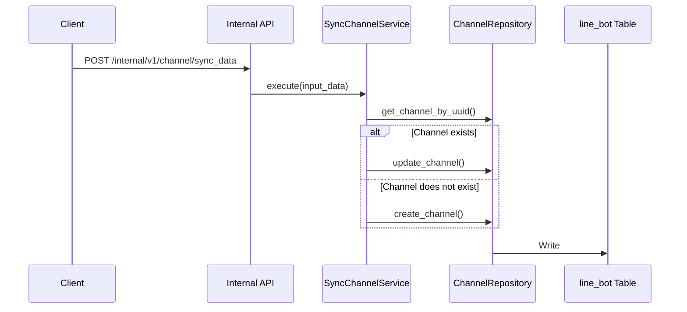
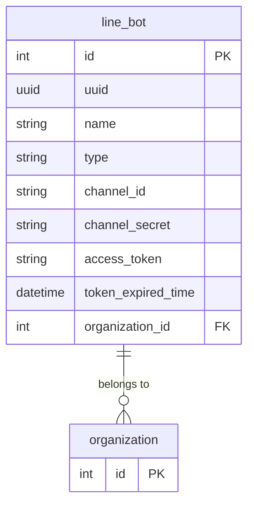

# Channel (Bot)
---

## Database Model Reality: All Channels Use `line_bot` Table

> **There is no separate `Channel` model or table in the database. All channel types—legacy LINE bots and new omnichannel channels (FB, IG, etc.)—are persisted in the same table/model: `line_bot`.**

- The `type` field in `line_bot` distinguishes the channel type (e.g., `line`, `fb`, `ig`, etc.).
- The new `Channel` abstraction (DTO/domain) is a logical and API/service layer contract for omnichannel support, not a new DB table.
- The `id` field in `line_bot` is the canonical identifier for both legacy bots and new channels.
- **Do not use or reference the deleted `channel_channel` table. All channel data is in `line_bot`.**

---

## Feature Overview

- Provides a unified abstraction for both legacy LINE bots and new omnichannel channels.
- Enables future extensibility for additional channel types.
- Maintains backward compatibility by treating `bot_id` and `channel_id` as equivalent.

---

## Major Workflows

### 1. LINE Bot Creation
- Created via the org's internal `/organization/{org_id}/bots` API.
    - [internal/views.py:OrganizationViewSet.bots](../internal/views.py#L793)
    - [line/services/bot.py:CreateBotService](../line/services/bot.py#L154)
    - [line/repositories/bot.py:BotRepository](../line/repositories/bot.py#L18)
    - [line/repositories/bot.py:BotRepository.create_bot](../line/repositories/bot.py#L30)
- Data persisted in `line_bot` table.

### 2. Omnichannel Channel Creation
- Created via the `/internal/v1/channel/sync_data` internal API (the only recommended way).
    - [internal/views.py:ChannelViewSet.sync_data](../internal/views.py#L964)
    - [channel/services/channel.py:SyncChannelService.execute](../channel/services/channel.py#L14)
    - [channel/repositories/channel.py:ChannelRepository.create_channel](../channel/repositories/channel.py#L105)
- Data persisted in `line_bot` table.

#### Sequence Diagram: Channel Creation


---

## Key Data Contracts (DTOs)

- `ChannelInput`, `ChannelForCreate` ([channel/domains/channel.py](../channel/domains/channel.py#L76))
- `BotForCreate` ([line/domains/bot.py](../line/domains/bot.py#L14))

---

## System Architecture (ERD)



---

## Channel Type Support

- **Currently, most downstream features only support the `line` channel type.**
- Support for other types (Facebook, Instagram, etc.) is limited or not yet implemented.
- **Consult individual feature KBs** to determine channel support for each feature.

---

## Field Mapping Table

| Field Name                | Line Bot (legacy) | Channel (omnichannel) | Required | Notes                                      |
|--------------------------|-------------------|-----------------------|----------|--------------------------------------------|
| id                       | id                | id                    | Yes      | Primary key in `line_bot`                  |
| channel_id               | channel_id        | channel_id            | Yes      | External channel identifier                |
| channel_secret           | channel_secret    |                       | Line only| Used for Line, not all channels            |
| access_token             | access_token      | access_token          | Yes      | Token for API calls                        |
| token_expired_time       | token_expired_time| access_token_expired_at| Yes      | Token expiry                               |
| name                     | name              | name                  | Yes      | Channel display name                       |
| type                     | type              | type                  | Yes      | 'line', 'fb', 'ig', etc.           |
| organization_id          | organization_id   | organization_id       | Yes      | Organization foreign key                   |
| enable                   | enable            | enable                | Yes      | Channel active status                      |
| ...                      | ...               | ...                   |          |                                            |

- See DTOs for full field list and type details.
- Some fields are only relevant for certain channel types (e.g., `channel_secret` for Line).

---

## External Dependencies

- Dependent on Admin Center (interlude) and CSM helper for some operations and integrations.

---

## Edge Cases & Technical Traps

- **Do not use or reference the deleted `channel_channel` table.**
- Most features only support `line` type; adding new types may require feature-level changes.
- Always use [`/internal/v1/channel/sync_data`](../internal/views.py#L964) for omnichannel channel management.
- Ensure `type` is set correctly to avoid downstream errors.

---

## Test Coverage

- Some tests exist for bot repository and service layer ([line/tests/repositories/test_bot.py](../line/tests/repositories/test_bot.py), [line/tests/services/test_bot.py](../line/tests/services/test_bot.py)).
- **Test coverage for both bot and channel creation is currently limited.**
- Edge cases (duplicate IDs, missing org, unsupported type) may not be fully covered.
- **Recommendation:** Expand pytest coverage for `internal/v1/channel/sync_data` and new channel types.

---

## Migration/Refactor Patterns

- When refactoring legacy code, replace direct usage of `bot`/`line_bot` with the `Channel` abstraction (DTO/service layer).
- Example:
    - **Legacy:**
        ```python
        from line.repositories.bot import BotRepository  # [line/repositories/bot.py#L18]
        bot = BotRepository().get_bot(bot_id)  # [line/repositories/bot.py#L43]
        # ... use bot fields directly
        ```
    - **Refactored:**
        ```python
        from channel.repositories.channel import ChannelRepository  # [channel/repositories/channel.py#L19]
        channel = ChannelRepository().get_channel(id)  # [channel/repositories/channel.py#L167]
        # ... use channel abstraction
        ```
- Always use the service and repository layers for business logic and DB access.
- For new features, use the `Channel` abstraction and `/internal/v1/channel/sync_data` API.

---

## How to Extend/Debug

- Add new channel types by extending the `type` field and updating DTOs/services.
- Check feature KBs for channel support before using new types in downstream features.
- Use pytest to add/verify tests for new channel types and edge cases.

---

## Known TODOs/Technical Debt

- Expand test coverage for channel creation and edge cases.
- Gradually refactor legacy code to use the `Channel` abstraction.
- Update feature KBs as new channel types are supported. 