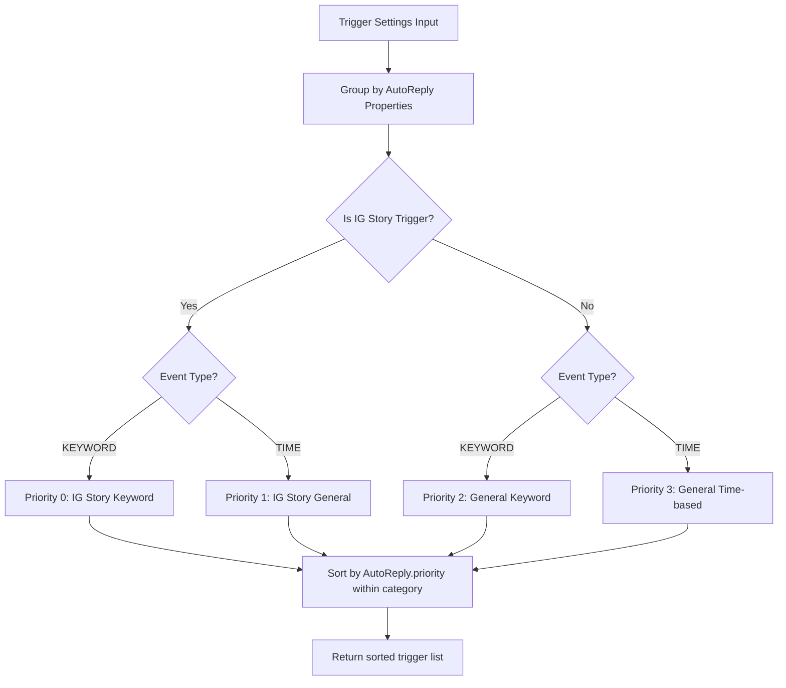
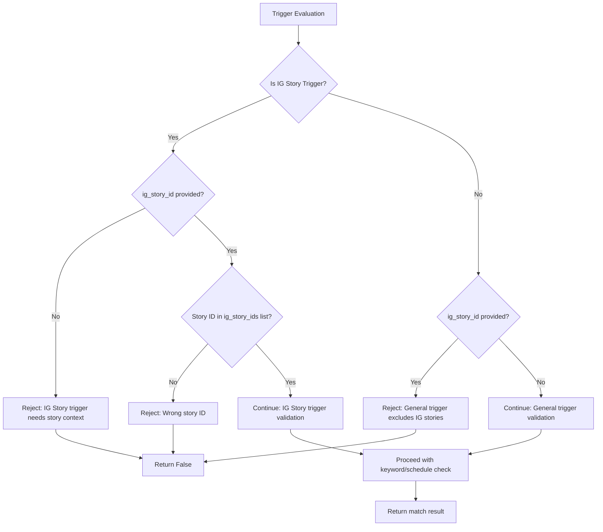
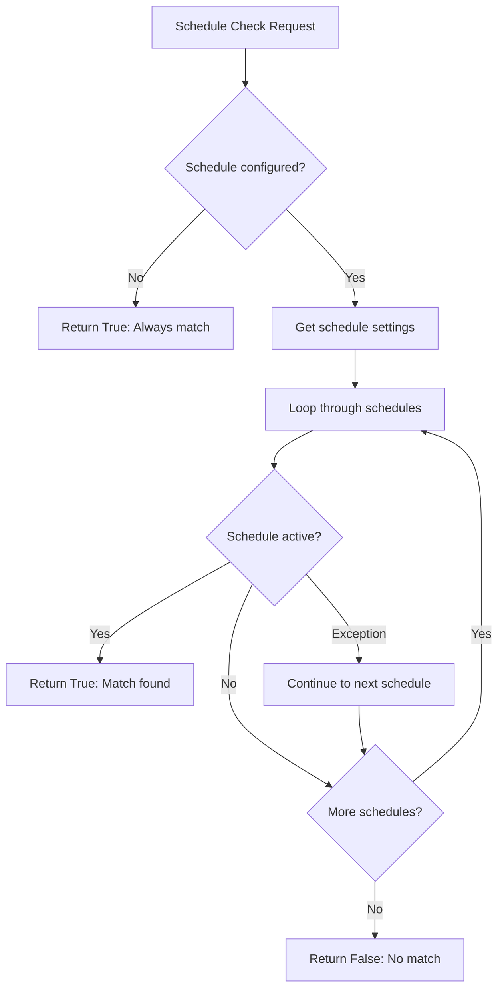
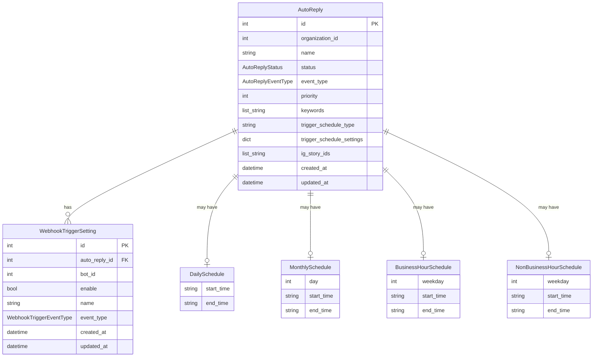
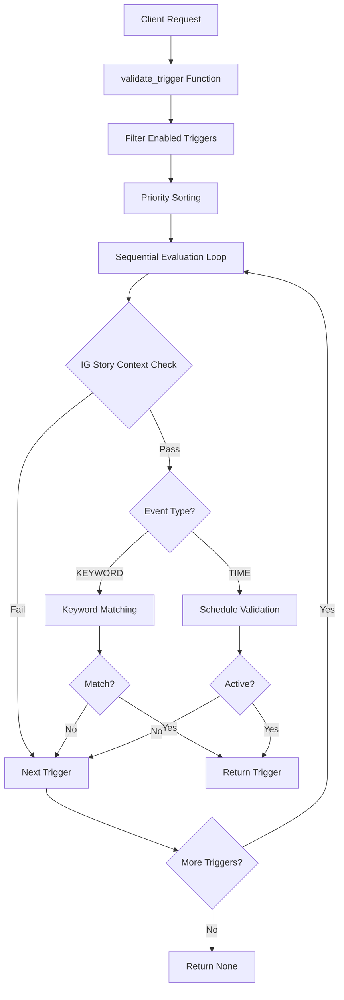

# IG Story Auto-Reply Trigger Validation System

---

## 1. **Feature Overview**
- **Feature Name:** IG Story Auto-Reply Trigger Validation System
- **Purpose:** 
  - Provides comprehensive trigger validation logic for Instagram Story auto-reply functionality
  - Implements a 4-level priority system ensuring most specific triggers take precedence
  - Supports keyword-based, general time-based, and IG story-specific auto-reply rules
  - Enables contextually relevant responses to story interactions while maintaining backward compatibility with general messaging
- **Main Use Cases:**
  - IG Story keyword auto-reply (highest priority)
  - IG Story general/time-based auto-reply (second priority)
  - General keyword auto-reply (third priority)
  - General time-based auto-reply (lowest priority)
  - Cross-timezone scheduling and validation
  - Exclusion logic to prevent interference between IG story and general triggers

---

## 2. **Major Workflows**

### 2.1. **Main Trigger Validation Flow**
**Trigger:** `validate_trigger()` function call with message content, event time, and optional IG story context

**Step-by-step:**
1. **Input validation** - Filter enabled triggers ([validate_trigger.py:validate_trigger](../python_src/internal/domain/auto_reply/validate_trigger.py#L71))
2. **Priority sorting** - Sort triggers by 4-level hierarchy ([priority_sorter.py:sort_triggers_by_priority](../python_src/internal/domain/auto_reply/priority_sorter.py#L7))
3. **Sequential evaluation** - Test triggers in priority order ([validate_trigger.py:validate_trigger](../python_src/internal/domain/auto_reply/validate_trigger.py#L86))
4. **Trigger matching** - Evaluate individual trigger conditions ([validate_trigger.py:_evaluate_trigger](../python_src/internal/domain/auto_reply/validate_trigger.py#L99))
5. **Result return** - Return first matching trigger or None ([validate_trigger.py:validate_trigger](../python_src/internal/domain/auto_reply/validate_trigger.py#L94))

```mermaid
sequenceDiagram
    participant Client
    participant ValidateTrigger as validate_trigger()
    participant PrioritySorter as sort_triggers_by_priority()
    participant TriggerEvaluator as _evaluate_trigger()
    participant KeywordMatcher as match_keywords()
    participant ScheduleChecker as _check_schedule_match()

    Client->>ValidateTrigger: validate_trigger(settings, auto_replies, message, time, timezone, ig_story_id)
    ValidateTrigger->>ValidateTrigger: Filter enabled triggers
    ValidateTrigger->>PrioritySorter: Sort by priority system
    PrioritySorter-->>ValidateTrigger: Sorted triggers
    
    loop For each trigger in priority order
        ValidateTrigger->>TriggerEvaluator: _evaluate_trigger()
        alt IG Story Logic Check
            TriggerEvaluator->>TriggerEvaluator: Check IG story context
        end
        alt Keyword Trigger
            TriggerEvaluator->>KeywordMatcher: match_keywords()
            KeywordMatcher-->>TriggerEvaluator: Match result
        else Time Trigger
            TriggerEvaluator->>ScheduleChecker: _check_schedule_match()
            ScheduleChecker-->>TriggerEvaluator: Schedule result
        end
        TriggerEvaluator-->>ValidateTrigger: Match result
        break If match found
    end
    ValidateTrigger-->>Client: First matching trigger or None
```

### 2.2. **Priority System Workflow**
**Priority Order (Highest to Lowest):**
1. **IG Story Keyword** (Category 0)
2. **IG Story General** (Category 1)  
3. **General Keyword** (Category 2)
4. **General Time-based** (Category 3)

**Implementation:** ([priority_sorter.py:get_priority_key](../python_src/internal/domain/auto_reply/priority_sorter.py#L27))



### 2.3. **IG Story Context Validation**
**Trigger:** Message with potential IG story context

**Logic:** ([validate_trigger.py:_evaluate_trigger](../python_src/internal/domain/auto_reply/validate_trigger.py#L120))



### 2.4. **Schedule Validation Workflow**
**Trigger:** Time-based trigger evaluation

**Implementation:** ([validate_trigger.py:_check_schedule_match](../python_src/internal/domain/auto_reply/validate_trigger.py#L145))



---

## 3. **Key Data Contracts & Payloads**

### 3.1. **Core Models**

#### AutoReply Model ([auto_reply.py:AutoReply](../python_src/internal/domain/auto_reply/auto_reply.py#L10))
```python
class AutoReply(BaseModel):
    id: int
    organization_id: int
    name: str
    status: AutoReplyStatus
    event_type: AutoReplyEventType  # KEYWORD or TIME
    priority: int
    keywords: list[str] | None = None
    trigger_schedule_type: WebhookTriggerScheduleType | None = None
    trigger_schedule_settings: WebhookTriggerScheduleSettings | None = None
    ig_story_ids: list[str] | None = None  # IG Story specific configuration
    created_at: datetime
    updated_at: datetime
```

#### WebhookTriggerSetting Model ([webhook_trigger.py:WebhookTriggerSetting](../python_src/internal/domain/auto_reply/webhook_trigger.py#L8))
```python
class WebhookTriggerSetting(BaseModel):
    id: int
    auto_reply_id: int
    bot_id: int
    enable: bool
    name: str
    event_type: WebhookTriggerEventType
    created_at: datetime
    updated_at: datetime
```

### 3.2. **Schedule System (Polymorphic Design)**

#### Base Schedule Protocol ([webhook_trigger.py:Schedule](../python_src/internal/domain/auto_reply/webhook_trigger.py#L30))
```python
class Schedule(Protocol):
    def is_active(self, event_time: datetime, timezone: str = "Asia/Taipei") -> bool:
        """Check if schedule is active at given time."""
        ...
```

#### Daily Schedule ([webhook_trigger.py:DailySchedule](../python_src/internal/domain/auto_reply/webhook_trigger.py#L35))
```python
class DailySchedule(BaseModel):
    start_time: str  # Format: "HH:MM"
    end_time: str    # Format: "HH:MM"
    
    def is_active(self, event_time: datetime, timezone: str = "Asia/Taipei") -> bool:
        # Supports midnight crossing (e.g., "22:00" to "06:00")
```

#### Monthly Schedule ([webhook_trigger.py:MonthlySchedule](../python_src/internal/domain/auto_reply/webhook_trigger.py#L77))
```python
class MonthlySchedule(BaseModel):
    day: int         # 1-31
    start_time: str  # Format: "HH:MM"
    end_time: str    # Format: "HH:MM"
    
    def is_active(self, event_time: datetime, timezone: str = "Asia/Taipei") -> bool:
        # Monthly day and time range validation
```

### 3.3. **Function Signatures**

#### Main Validation Function ([validate_trigger.py:validate_trigger](../python_src/internal/domain/auto_reply/validate_trigger.py#L12))
```python
def validate_trigger(
    trigger_settings: list[WebhookTriggerSetting], 
    auto_replies: dict[int, AutoReply],
    message_content: str, 
    event_time: datetime,
    organization_timezone: str = "Asia/Taipei",
    ig_story_id: str | None = None
) -> WebhookTriggerSetting | None:
```

#### Keyword Matching Function ([keyword_matcher.py:match_keywords](../python_src/internal/domain/auto_reply/keyword_matcher.py#L3))
```python
def match_keywords(keywords: list[str] | None, message_content: str) -> bool:
    # Exact match with case-insensitive, space-trimmed normalization
```

---

## 4. **System Architecture, Data Flow, and Reporting**

### 4.1. **Model Relationships & Architecture**



### 4.2. **Data Flow Architecture**



### 4.3. **Cross-Feature Integration Architecture**

The trigger validation system integrates with multiple features through standardized interfaces:

1. **Message Processing Pipeline**: Validates triggers for incoming messages
2. **Schedule Management**: Timezone-aware schedule evaluation for different regions
3. **Analytics**: Provides trigger match data for reporting systems
4. **IG Story Context**: Specialized handling for Instagram Story interactions

#### Integration Points:
- **Input**: Message content, event timestamps, optional IG story context
- **Output**: Matched trigger settings or None for downstream processing
- **Dependencies**: Organization timezone settings, schedule configurations

---

## 5. **External Dependencies**

### 5.1. **Python Standard Library**
- `datetime`: Timezone-aware time processing ([validate_trigger.py](../python_src/internal/domain/auto_reply/validate_trigger.py#L3))
- `zoneinfo`: Timezone handling for schedule validation ([webhook_trigger.py](../python_src/internal/domain/auto_reply/webhook_trigger.py#L3))

### 5.2. **Third-Party Dependencies**
- **Pydantic**: Data validation and model definitions ([auto_reply.py](../python_src/internal/domain/auto_reply/auto_reply.py#L1))
  - Used for: Model validation, serialization, configuration management
  - Models: `AutoReply`, `WebhookTriggerSetting`, all schedule types

### 5.3. **Internal Domain Dependencies**
- **Common Error Handling**: Domain error types and error construction ([validate_trigger.py](../python_src/internal/domain/auto_reply/validate_trigger.py#L1))
- **Organization Models**: Timezone configuration and business hours (referenced in business hour schedules)

### 5.4. **No External Services**
- System is fully self-contained for core validation logic
- No database dependencies at the validation layer
- No external API calls required for trigger evaluation

---

## 6. **Edge Cases & Constraints**

### 6.1. **Timezone Handling Edge Cases**
- **Midnight Crossing**: Daily schedules crossing midnight boundaries ([webhook_trigger.py:DailySchedule.is_active](../python_src/internal/domain/auto_reply/webhook_trigger.py#L60))
  ```python
  # Example: 22:00 to 06:00 schedule
  if start_time > end_time:  # Midnight crossing
      return event_local_time >= start_time or event_local_time < end_time
  ```
- **Timezone Conversion**: Naive datetime assumes UTC ([webhook_trigger.py:DailySchedule.is_active](../python_src/internal/domain/auto_reply/webhook_trigger.py#L44))
- **Business Hours**: Future implementation will require organization timezone alignment

### 6.2. **Keyword Matching Constraints**
- **Exact Match Only**: No partial matching supported ([keyword_matcher.py:match_keywords](../python_src/internal/domain/auto_reply/keyword_matcher.py#L12))
- **Case Insensitive**: Normalization via `lower()` ([keyword_matcher.py:match_keywords](../python_src/internal/domain/auto_reply/keyword_matcher.py#L12))
- **Space Trimming**: Leading/trailing whitespace removed ([keyword_matcher.py:match_keywords](../python_src/internal/domain/auto_reply/keyword_matcher.py#L12))
- **Empty Keywords**: Returns False if keywords is None or empty ([keyword_matcher.py:match_keywords](../python_src/internal/domain/auto_reply/keyword_matcher.py#L7))

### 6.3. **IG Story Context Constraints**
- **Story ID Validation**: Must exactly match one of the configured `ig_story_ids` ([validate_trigger.py:_evaluate_trigger](../python_src/internal/domain/auto_reply/validate_trigger.py#L125))
- **Exclusion Logic**: General triggers excluded when `ig_story_id` provided ([validate_trigger.py:_evaluate_trigger](../python_src/internal/domain/auto_reply/validate_trigger.py#L130))
- **Context Requirement**: IG Story triggers fail without `ig_story_id` parameter ([validate_trigger.py:_evaluate_trigger](../python_src/internal/domain/auto_reply/validate_trigger.py#L125))

### 6.4. **Priority System Constraints**
- **First Match Wins**: Only the first matching trigger in priority order is returned ([validate_trigger.py:validate_trigger](../python_src/internal/domain/auto_reply/validate_trigger.py#L93))
- **No Parallel Evaluation**: Sequential evaluation stops at first match
- **Missing AutoReply**: Triggers with missing AutoReply get lowest priority ([priority_sorter.py:get_priority_key](../python_src/internal/domain/auto_reply/priority_sorter.py#L37))

### 6.5. **Schedule Exception Handling**
- **Graceful Degradation**: Schedule check exceptions are caught and logged ([validate_trigger.py:_check_schedule_match](../python_src/internal/domain/auto_reply/validate_trigger.py#L170))
- **Continue Processing**: Failed schedule checks don't break the evaluation loop

---

## 7. **Known Technical Traps**

### 7.1. **Priority Sorting Gotchas**
- **Category vs Priority**: Priority sorting first by category (0-3), then by `AutoReply.priority` within category ([priority_sorter.py:get_priority_key](../python_src/internal/domain/auto_reply/priority_sorter.py#L44))
  ```python
  # TRAP: Lower priority number = higher priority within same category
  return (category_priority, auto_reply_priority)  # Both ascending sort
  ```
- **Missing AutoReply Handling**: Returns (999, 999) priority tuple, placing at end ([priority_sorter.py:get_priority_key](../python_src/internal/domain/auto_reply/priority_sorter.py#L38))

### 7.2. **IG Story Exclusion Logic**
- **Strict Exclusion**: When `ig_story_id` is provided, ALL general triggers are excluded, not just non-matching ones ([validate_trigger.py:_evaluate_trigger](../python_src/internal/domain/auto_reply/validate_trigger.py#L130))
- **Context Sensitivity**: Same trigger behaves differently based on presence of `ig_story_id` parameter

### 7.3. **Timezone Pitfalls**
- **Naive DateTime**: System assumes naive datetime is UTC ([webhook_trigger.py:DailySchedule.is_active](../python_src/internal/domain/auto_reply/webhook_trigger.py#L44))
  ```python
  if event_time.tzinfo is None:
      event_time = event_time.replace(tzinfo=ZoneInfo("UTC"))
  ```
- **Month Boundary**: Monthly schedules don't handle month-end edge cases (day 31 in 30-day months)

### 7.4. **Error Handling Gaps**
- **Silent Failures**: Schedule validation exceptions are caught but only logged ([validate_trigger.py:_check_schedule_match](../python_src/internal/domain/auto_reply/validate_trigger.py#L170))
- **No Error Propagation**: Validation failures don't propagate error details to caller

### 7.5. **Performance Considerations**
- **Linear Search**: Sequential evaluation through all triggers in priority order
- **No Caching**: Each call re-evaluates all conditions
- **Memory Usage**: Creates full sorted list even if early match found

---

## 8. **Test Coverage**

### 8.1. **Core Test Files**

#### IG Story Features Tests ([test_ig_story_features.py](../python_src/tests/domain/auto_reply/test_ig_story_features.py))
- **TestIGStoryKeywordLogic**: Story 6 - IG Story keyword matching (5 tests)
- **TestIGStoryGeneralLogic**: Story 7 - IG Story time-based triggers (4 tests)  
- **TestIGStoryPriorityOverGeneral**: Story 8 - Priority system (3 tests)
- **TestIGStoryMultipleKeywords**: Story 9 - Multiple keyword support (2 tests)
- **TestCompletePrioritySystem**: Story 10 - Complete 4-level priority (4 tests)
- **TestIGStoryExclusionLogic**: Story 11 - Exclusion logic (4 tests)

#### Main Validation Tests ([test_validate_trigger.py](../python_src/tests/domain/auto_reply/test_validate_trigger.py))
- **TestKeywordReplyLogic**: PRD Story 1 - Keyword matching (4 tests)
- **TestMultipleKeywordsSupport**: PRD Story 2 - Multiple keywords (3 tests)
- **TestGeneralTimeBasedLogic**: PRD Story 3 - Time-based logic (3 tests)
- **TestPriorityLogic**: PRD Story 4 - Priority system (3 tests)
- **TestMessageContentHandling**: PRD Story 5 - Message handling (3 tests)

#### Supporting Tests
- **test_keyword_matcher.py**: Keyword matching edge cases (11 tests)
- **test_priority_sorter.py**: Priority sorting logic (5 tests)
- **test_timezone_support.py**: Timezone handling (9 tests)
- **test_webhook_trigger_schedule.py**: Schedule validation (6 tests)

### 8.2. **PRD Compliance Matrix**

| PRD Test Case | Test Function | Status |
|---------------|---------------|---------|
| B-P1-18-Test7 | `test_b_p1_18_test7_keyword_message_not_story_reply` | ✅ Pass |
| B-P1-18-Test8a | `test_b_p1_18_test8a_keyword_message_is_story_reply` | ✅ Pass |
| B-P1-18-Test8b | `test_b_p1_18_test8b_general_message_is_story_reply_in_schedule` | ✅ Pass |
| B-P1-18-Test9 | `test_b_p1_18_test9_story_specific_over_general_keyword` | ✅ Pass |
| IG-Story-Keyword-Test1 | `test_ig_story_keyword_trigger_with_matching_story_and_keyword` | ✅ Pass |
| IG-Story-Keyword-Test2 | `test_ig_story_keyword_trigger_with_wrong_story_id` | ✅ Pass |
| IG-Story-Keyword-Test3 | `test_ig_story_keyword_trigger_without_story_context` | ✅ Pass |
| Complete-Priority-Test1-4 | `test_complete_priority_test1-4_*` | ✅ Pass |

### 8.3. **Coverage Gaps**

#### Missing Test Areas:
1. **Business Hour Schedules**: No tests for business hour integration (placeholder implementation)
2. **Error Recovery**: No tests for schedule validation exception handling
3. **Performance**: No load testing for large trigger sets
4. **Memory**: No tests for memory usage with complex schedules
5. **Timezone Edge Cases**: Limited testing of timezone conversion edge cases

#### Critical Paths Covered:
- ✅ All 4 priority levels tested
- ✅ IG Story context validation
- ✅ Keyword matching normalization
- ✅ Schedule midnight crossing
- ✅ Exclusion logic validation

---

## 9. **Cache/State Management**

### 9.1. **Stateless Design**
The trigger validation system is completely stateless:
- **No Caching**: Each validation call processes fresh data
- **No Persistence**: No state maintained between calls
- **Pure Functions**: All functions are side-effect free

### 9.2. **Performance Optimization Opportunities**
While currently stateless, potential optimization areas include:

#### Schedule Parsing Cache:
```python
# Future optimization - cache parsed schedules
from functools import lru_cache

@lru_cache(maxsize=128)
def parse_time_schedule(start_time: str, end_time: str) -> tuple[time, time]:
    """Cache parsed time objects to avoid repeated parsing."""
```

#### Trigger Sorting Cache:
```python
# Future optimization - cache sorted triggers by configuration hash
def get_sorted_triggers_cached(trigger_settings: list, auto_replies: dict) -> list:
    """Cache trigger sorting results for identical configurations."""
```

### 9.3. **Memory Management**
- **Minimal Memory Footprint**: No persistent objects or large data structures
- **Garbage Collection Friendly**: All objects are short-lived and locally scoped
- **No Memory Leaks**: No circular references or persistent handlers

---

## 10. **How to Extend/Debug**

### 10.1. **Adding New Schedule Types**

#### Step 1: Create Schedule Model ([webhook_trigger.py](../python_src/internal/domain/auto_reply/webhook_trigger.py))
```python
class WeeklySchedule(BaseModel):
    weekday: int  # 1=Monday, 7=Sunday
    start_time: str
    end_time: str
    
    def is_active(self, event_time: datetime, timezone: str = "Asia/Taipei") -> bool:
        # Implementation here
        pass
```

#### Step 2: Update Schedule Union Type ([webhook_trigger.py](../python_src/internal/domain/auto_reply/webhook_trigger.py#L102))
```python
Schedule = DailySchedule | MonthlySchedule | WeeklySchedule | BusinessHourSchedule | NonBusinessHourSchedule
```

#### Step 3: Add Schedule Type Enum ([webhook_trigger.py](../python_src/internal/domain/auto_reply/webhook_trigger.py#L108))
```python
class WebhookTriggerScheduleType(str, Enum):
    DAILY = "daily"
    MONTHLY = "monthly"
    WEEKLY = "weekly"  # Add new type
    BUSINESS_HOUR = "business_hour"
    NON_BUSINESS_HOUR = "non_business_hour"
```

### 10.2. **Adding New Priority Categories**

#### Modify Priority Sorter ([priority_sorter.py:get_priority_key](../python_src/internal/domain/auto_reply/priority_sorter.py#L44))
```python
# Add new category (e.g., VIP customer priority)
if is_vip_customer and auto_reply.event_type == AutoReplyEventType.KEYWORD:
    category_priority = -1  # Highest priority
elif is_ig_story_trigger and auto_reply.event_type == AutoReplyEventType.KEYWORD:
    category_priority = 0   # Current highest becomes second
# ... rest of existing logic
```

### 10.3. **Debugging Common Issues**

#### Debug Trigger Not Matching:
```python
# Add logging to validate_trigger function
import logging
logger = logging.getLogger(__name__)

def validate_trigger(...):
    logger.debug(f"Evaluating {len(trigger_settings)} triggers")
    sorted_triggers = sort_triggers_by_priority(active_triggers, auto_replies)
    
    for i, trigger_setting in enumerate(sorted_triggers):
        auto_reply = auto_replies.get(trigger_setting.auto_reply_id)
        logger.debug(f"Trigger {i}: {auto_reply.name if auto_reply else 'Missing'}")
        
        if _evaluate_trigger(...):
            logger.info(f"Matched trigger: {auto_reply.name}")
            return trigger_setting
        else:
            logger.debug(f"No match: {auto_reply.name}")
```

#### Debug IG Story Context Issues:
```python
# Check IG story configuration
def debug_ig_story_context(auto_reply: AutoReply, ig_story_id: str | None):
    is_ig_story_trigger = auto_reply.ig_story_ids is not None and len(auto_reply.ig_story_ids) > 0
    print(f"Auto-reply: {auto_reply.name}")
    print(f"  IG Story IDs configured: {auto_reply.ig_story_ids}")
    print(f"  Is IG Story trigger: {is_ig_story_trigger}")
    print(f"  Provided story ID: {ig_story_id}")
    
    if is_ig_story_trigger and ig_story_id:
        print(f"  Story ID match: {ig_story_id in auto_reply.ig_story_ids}")
```

#### Debug Schedule Issues:
```python
# Test schedule directly
from zoneinfo import ZoneInfo

def debug_schedule(schedule, test_time_str: str, timezone: str = "Asia/Taipei"):
    test_time = datetime.fromisoformat(test_time_str).replace(tzinfo=ZoneInfo(timezone))
    result = schedule.is_active(test_time, timezone)
    print(f"Schedule: {schedule}")
    print(f"Test time: {test_time}")
    print(f"Is active: {result}")
```

### 10.4. **Extension Points**

#### Keyword Matching Extensions ([keyword_matcher.py](../python_src/internal/domain/auto_reply/keyword_matcher.py)):
- Add fuzzy matching support
- Implement regex pattern matching
- Add multi-language normalization

#### Schedule Extensions ([webhook_trigger.py](../python_src/internal/domain/auto_reply/webhook_trigger.py)):
- Add recurring weekly patterns
- Implement holiday exclusions
- Add timezone-specific business hours

#### Priority Extensions ([priority_sorter.py](../python_src/internal/domain/auto_reply/priority_sorter.py)):
- Add user-based priority modifiers
- Implement context-aware prioritization
- Add A/B testing priority groups

---

## 11. **Known TODOs/Technical Debt**

### 11.1. **Business Hours Integration**
- **Location**: Business hour schedule implementations are placeholder ([webhook_trigger.py:BusinessHourSchedule](../python_src/internal/domain/auto_reply/webhook_trigger.py#L128))
- **Issue**: Requires integration with organization domain for actual business hour data
- **Impact**: Business hour and non-business hour triggers cannot be properly tested

### 11.2. **Performance Optimization**
- **Location**: Priority sorting and sequential evaluation ([validate_trigger.py:validate_trigger](../python_src/internal/domain/auto_reply/validate_trigger.py#L84))
- **Issue**: Linear time complexity for trigger evaluation
- **Improvement**: Consider indexed lookup or early termination strategies for large trigger sets

### 11.3. **Error Handling Enhancement**
- **Location**: Schedule validation exception handling ([validate_trigger.py:_check_schedule_match](../python_src/internal/domain/auto_reply/validate_trigger.py#L170))
- **Issue**: Exceptions are silently caught and logged without detailed error reporting
- **Improvement**: Add structured error reporting and recovery mechanisms

### 11.4. **Timezone Edge Case Coverage**
- **Location**: Various schedule implementations ([webhook_trigger.py](../python_src/internal/domain/auto_reply/webhook_trigger.py))
- **Issue**: Limited handling of timezone edge cases (DST transitions, invalid timezones)
- **Improvement**: Add comprehensive timezone validation and DST handling

### 11.5. **Schedule Validation**
- **Location**: Monthly schedule day validation ([webhook_trigger.py:MonthlySchedule](../python_src/internal/domain/auto_reply/webhook_trigger.py#L77))
- **Issue**: No validation for day 31 in months with fewer days
- **Improvement**: Add month-aware day validation

### 11.6. **Test Data Management**
- **Location**: Test files use hardcoded test data ([test_ig_story_features.py](../python_src/tests/domain/auto_reply/test_ig_story_features.py))
- **Issue**: Repeated test data creation across test files
- **Improvement**: Create test data factories or fixtures for better maintainability

### 11.7. **Logging Standardization**
- **Location**: Inconsistent logging across modules
- **Issue**: Debug information is not consistently logged
- **Improvement**: Add structured logging with consistent format and levels

---